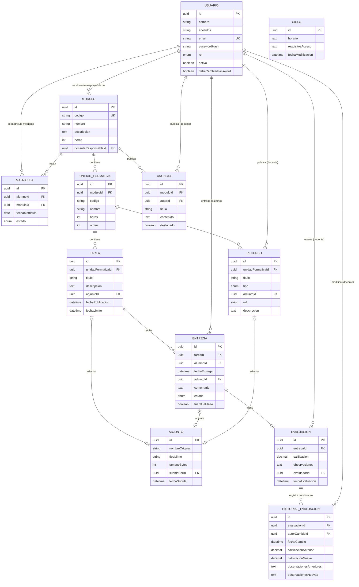
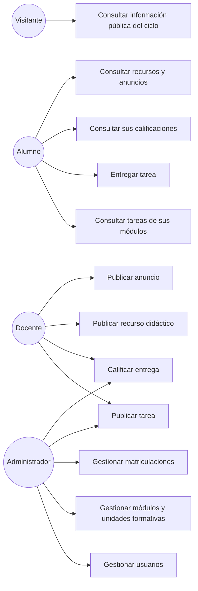

# Especificación Funcional (Maestra) — Gestor Académico de Ciclo Formativo (GestorFP)

**Estado:** Aprobada para desarrollo (iteración 4)
**Autor:** Manuel María Balbás Naveira
**Fecha:** 2026-09-22 (v1.0) · revisada 2026-09-22 (v1.1 — reestructuración en 3 specs por módulo;
v1.2 — medidas de seguridad concretas para RNF-002/003, nuevos RNF-011/012/013, ver
`docs/adr/0002-seguridad-sesion-y-datos.md`; v1.3 — WCAG 2.2 AA en OT-3, alineado con
`memory/constitution.md` v3.0.0 tras `docs/adr/0003-constitucion-agnostica-tecnologia.md`; v1.4
(2026-09-23) — clarificaciones: adjuntos (RNF-014), reemplazo de entregas, historial de
calificaciones (RF-016) y restablecimiento y cambio de contraseña (RF-017/018) y contrato de
subida de ficheros en §12, cierran CA-01, CA-02 y CA-06; v1.5 (2026-09-23) — contraseña
temporal en el alta de usuario, RF-008; v1.6 (2026-09-23) — clarificaciones para el servidor: zona
horaria, `fueraDePlazo`, baja de usuario, cambio de plazo y matrícula en baja; v1.7 (2026-09-23) —
alcance: información del ciclo (RF-019), sin estados `PENDIENTE`/`BORRADOR`, edición y borrado
de recursos, anuncios y tareas; v1.8 (2026-09-23) — cierre de huecos del contrato antes de
implementar `002`: `POST /auth/logout` en §12, qué edita un usuario de sí mismo, consulta de
matrículas incrustada en `GET /modulos`, entrega vacía, paginación, límite de intentos solo en el
login y casos límite de alumnado dado de baja)
**Rige bajo:** `memory/constitution.md` v3.0.0
**Certificado de referencia:** IFCD0210 — Desarrollo de aplicaciones con tecnologías web

> **Este documento es la única fuente del "qué"** (historias de usuario, requisitos, modelo de
> datos, contrato de API). El "cómo" y el "cuándo" de cada capa se detallan en el `plan.md` y
> `tasks.md` de su módulo correspondiente, cada uno desarrollado en su propia rama:
>
> | Spec | Módulo del certificado | Rama |
> |---|---|---|
> | `specs/001-entorno-cliente/` | MF0491_3 — Programación web en el entorno cliente | `feature/001-entorno-cliente` |
> | `specs/002-entorno-servidor/` | MF0492_3 — Programación web en el entorno servidor | `feature/002-entorno-servidor` |
> | `specs/003-implantacion/` | MF0493_3 — Implantación de aplicaciones web | `feature/003-implantacion` |
>
> Ninguna historia de usuario, requisito o entidad de este documento se duplica en los documentos
> de módulo: si algo cambia aquí, se actualiza aquí y solo aquí (Principio 1 de la constitución).

---

## 1. Resumen ejecutivo

GestorFP es una aplicación web que digitaliza la gestión académica de un **ciclo formativo**:
módulos y unidades formativas, tareas y entregas, calificaciones, recursos didácticos y
comunicados. Sustituye el uso disperso de correo electrónico, hojas de cálculo y carpetas
compartidas por un único sistema con roles diferenciados para equipo docente, alumnado y
visitantes.

El proyecto se construye siguiendo un flujo **spec-driven** y está diseñado para que su
desarrollo ejercite, de forma trazable y **en el mismo orden en que el certificado las enseña**,
las tres unidades de competencia de IFCD0210: desarrollo en entorno cliente (UC0491_3), desarrollo
en entorno servidor (UC0492_3) e implantación/verificación/documentación (UC0493_3). Ver §11 sobre
una decisión de stack que matiza esta trazabilidad en el entorno cliente.

## Clarifications

### Session 2026-09-23

- Q: ¿Dónde deben guardarse los ficheros que adjunta el alumnado en sus entregas y el docente en tareas y recursos? (CA-01) → A: Subida real a un volumen persistente del servidor (volumen Docker), servida por la API con control de permisos (RNF-014).
- Q: ¿Qué tamaño máximo y qué tipos de fichero se aceptan en las subidas? (RNF-014) → A: Máximo 10 MB por fichero; solo PDF, ZIP, PNG, JPG, DOCX y ODT.
- Q: Si un alumno ya ha entregado una tarea, ¿puede volver a entregarla? (RF-003) → A: Sí, puede reemplazarla mientras no esté calificada (se recalculan fecha, contenido y plazo); ya calificada, se rechaza con `409`.
- Q: Cuando se modifica una calificación ya registrada, ¿qué debe quedar guardado de ese cambio? (CA-06) → A: Historial de cada cambio (quién, cuándo, nota y observaciones anteriores y nuevas), visible para el docente del módulo y el ADMINISTRADOR (RF-016).
- Q: Si un usuario olvida su contraseña, ¿cómo recupera el acceso? (CA-02) → A: Sin autoservicio en v1.0: el ADMINISTRADOR asigna una contraseña temporal que el usuario debe cambiar en su siguiente acceso (RF-017).
- Q: ¿Cómo se suben y descargan los ficheros en la API? → A: Los mismos `POST` de entrega, tarea y recurso aceptan `multipart/form-data` con un campo `fichero` opcional; la descarga es `GET /adjuntos/{id}` con los permisos del elemento al que pertenece (§12).
- Q: ¿Cuántos ficheros admite cada entrega, tarea o recurso en v1.0? → A: Uno por elemento; varios ficheros se agrupan en un ZIP (RNF-014).
- Q: Al restablecer una contraseña, ¿quién genera la contraseña temporal? → A: La genera el servidor (aleatoria) y la devuelve una sola vez en la respuesta (RF-017).
- Q: ¿Qué reglas debe cumplir una contraseña nueva al cambiarla? → A: Mínimo 8 caracteres, con al menos una mayúscula, un número y un símbolo, y distinta de la actual (RF-018).
- Q: ¿Qué contraseña recibe un usuario al crearlo con `POST /usuarios`? → A: El servidor genera una contraseña temporal, la devuelve una sola vez en la respuesta del alta y obliga a cambiarla en el primer acceso, igual que en el restablecimiento (RF-008, RF-017).
- Q: ¿Con qué hora oficial se decide si una entrega llega fuera de plazo y se muestran las fechas límite? (RF-004) → A: Todo se guarda en UTC; las fechas que introduce o ve el usuario se interpretan y muestran en hora peninsular española (`Europe/Madrid`, con cambio de verano); el plazo se compara en UTC (RF-004, RNF-010).
- Q: Cuando se califica una entrega que llegó fuera de plazo, ¿debe seguir constando que fue tardía? (RF-004, §8) → A: Sí: campo aparte `fueraDePlazo` que se calcula al entregar o reemplazar y no cambia al calificar; `estado` queda ENTREGADA → CALIFICADA (desaparece `ENTREGADA_FUERA_DE_PLAZO`).
- Q: Cuando el administrador da de baja a un usuario, ¿qué pasa con su sesión abierta y con sus datos? (RF-008) → A: Pierde el acceso al instante (se revocan sus sesiones y tokens); sus entregas, notas y matrículas se conservan; no se puede dar de baja a un docente responsable de algún módulo hasta reasignarlo (`409`).
- Q: Si el docente cambia la fecha límite de una tarea que ya tiene entregas, ¿se recalcula qué entregas llegaron fuera de plazo? (RF-004) → A: Ampliar el plazo se permite siempre y recalcula `fueraDePlazo` de todas sus entregas, incluidas las calificadas; acortarlo con entregas ya hechas se rechaza con `409`.
- Q: Cuando se revoca la matrícula de un alumno en un módulo, ¿qué puede seguir viendo o haciendo en ese módulo? (RF-010, RNF-012) → A: Deja de ver tareas, recursos y anuncios y no puede entregar (`403`), pero sigue viendo sus propias entregas y calificaciones y descargando sus propios ficheros entregados.
- Q: ¿Qué información del ciclo debe mostrar el panel público al visitante, además de la lista de módulos con sus horas? (HU-06, RF-011) → A: La descripción de cada módulo y un bloque único de información del ciclo (horario y requisitos de acceso) que edita el ADMINISTRADOR (RF-011, RF-019).
- Q: ¿Qué debe significar el estado `PENDIENTE` de una entrega, si una entrega solo se crea cuando el alumno entrega algo? (§8, HU-03) → A: Se elimina como estado guardado; el listado de entregas de una tarea muestra además, sin guardarlo, al alumnado con matrícula activa que aún no ha entregado (RF-005, §12).
- Q: ¿Pueden los docentes guardar una tarea como borrador, invisible para el alumnado, y publicarla más tarde? (§8, HU-01) → A: No: una tarea se publica al crearla (`fechaPublicacion` = momento de creación) y se elimina el estado de la tarea (`BORRADOR`/`PUBLICADA`).
- Q: ¿Pueden los docentes corregir o retirar recursos, anuncios y tareas después de publicarlos? (§12, RF-012, RF-013) → A: El docente del módulo puede editar y borrar recursos y anuncios (borrar un DOCUMENTO borra su fichero); las tareas se editan como ya existía y solo se borran si no tienen entregas (`409` si las tienen).
- Q: Un usuario que no es ADMINISTRADOR, ¿qué puede cambiar de sí mismo con `PUT /usuarios/{id}`? (RF-008, RNF-012) → A: Solo nombre y apellidos; el resto de campos (rol, email, activo, `debeCambiarPassword`) se ignoran sin error. El email es la identidad de acceso y solo lo cambia el ADMINISTRADOR.
- Q: ¿Cómo consulta el ADMINISTRADOR las matrículas existentes, si §12 no tiene un `GET` de matrículas? (RF-010) → A: `GET /modulos` incluye en cada módulo sus unidades formativas y, solo cuando quien consulta es ADMINISTRADOR, sus matrículas `ACTIVA`; al resto de roles no se les muestran los datos del alumnado matriculado.
- Q: ¿Se limita también el número de peticiones a `/auth/refresh`? (RNF-011) → A: No: el límite de intentos se aplica solo a `/auth/login`, el único endpoint que recibe una contraseña; el refresh token es un valor aleatorio en cookie `HttpOnly` que no se puede adivinar.
- Q: ¿Aparece en «sin entregar» un alumno dado de baja como usuario, y se puede matricular a un usuario que no es ALUMNO o está dado de baja? (RF-005, RF-010) → A: El alumno dado de baja (`activo = false`) no aparece en `sinEntregar`; matricular a un usuario que no es ALUMNO o no está activo responde `400`.
- Q: ¿Qué pasa si un alumno envía una entrega sin fichero ni comentario? (RF-003) → A: Se rechaza con `422` («La entrega debe incluir un fichero y/o un comentario»), como ya hace el backend simulado de `001`.

## 2. Objetivos

### 2.1 Objetivos de negocio

| ID | Objetivo | Métrica de éxito |
|---|---|---|
| OB-1 | Centralizar la gestión de tareas y calificaciones de un módulo | 100% de las tareas del módulo publicadas y calificadas dentro de la plataforma (0 uso de canales alternativos) |
| OB-2 | Reducir el tiempo administrativo del equipo docente | ≥ 30% de reducción en tiempo dedicado a registrar calificaciones frente al proceso manual actual |
| OB-3 | Mejorar la transparencia del progreso académico para el alumnado | ≥ 90% del alumnado consulta sus calificaciones a través de la plataforma en lugar de preguntar directamente |
| OB-4 | Servir como proyecto de referencia docente del certificado IFCD0210 | 100% de los RF trazados a una unidad de competencia (ver §10) |
| OB-5 | Servir como pieza de portfolio profesional para búsqueda de empleo remoto | Stack y prácticas (React, testing, CI/CD) representativas del mercado laboral actual |

### 2.2 Objetivos técnicos

| ID | Objetivo | Métrica de éxito |
|---|---|---|
| OT-1 | Cumplir la Constitución del proyecto sin excepciones | 0 incumplimientos abiertos en `main` |
| OT-2 | Cobertura de pruebas en capa de servicio (backend) | ≥ 70% (JaCoCo) |
| OT-3 | Accesibilidad WCAG 2.2 AA | Puntuación Lighthouse Accessibility ≥ 90 en todas las vistas |
| OT-4 | Rendimiento de la API | p95 < 2 s por endpoint bajo carga nominal |

## 3. Alcance

### 3.1 Dentro del alcance (v1.0)

- Gestión de usuarios y roles (alta, edición, baja lógica, cambio de contraseña, restablecimiento de
  contraseña por el ADMINISTRADOR).
- Gestión de módulos y unidades formativas de un único ciclo formativo.
- Matriculación de alumnado en módulos.
- Publicación de tareas (con fecha límite y adjuntos) por unidad formativa.
- Entrega de tareas por el alumnado (fichero y/o comentario) antes o después de la fecha límite
  (marcada como fuera de plazo).
- Calificación de entregas por el equipo docente, con observaciones.
- Publicación de recursos didácticos (documentos, vídeos, enlaces) por unidad formativa.
- Publicación de anuncios/comunicados a nivel de módulo.
- Panel público (visitante) con información general del ciclo: módulos, horario, requisitos de
  acceso — sin datos personales de alumnado.
- API REST documentada (OpenAPI) que expone toda la funcionalidad anterior (contrato en §12).
- Autenticación JWT y autorización basada en roles.

### 3.2 Fuera del alcance (v1.0)

- Mensajería privada / chat en tiempo real entre usuarios.
- Videoconferencia o clases en directo integradas.
- Generación automática de boletines de notas oficiales / integración con Séneca u otras
  plataformas autonómicas de gestión educativa.
- Pagos o gestión económica de matrícula.
- Aplicación móvil nativa (la web es responsive, pero no hay app iOS/Android).
- Multi-tenant (gestión de varios centros o ciclos simultáneos).
- Internacionalización (i18n): la aplicación se entrega únicamente en español.
- Recuperación de contraseña por autoservicio ("olvidé mi contraseña" por correo): en v1.0 la
  recupera el ADMINISTRADOR (RF-017), sin servidor de correo.
- **Módulo MP0391** (Prácticas Profesionales No Laborales, 80h) del certificado: es una estancia
  formativa en empresa (comportamiento, integración, PRL); no tiene contenido de desarrollo
  software y por tanto no genera ningún requisito funcional en esta aplicación. Se menciona aquí
  explícitamente para dejar constancia de que su ausencia es intencionada, no un olvido.

## 4. Usuarios y roles

| Rol | Descripción | Autenticado |
|---|---|---|
| **ADMINISTRADOR** | Jefatura de estudios / coordinación del ciclo. Gestiona usuarios, módulos, unidades formativas y matriculaciones. Acceso completo. | Sí |
| **DOCENTE** | Imparte uno o más módulos. Publica tareas, recursos y anuncios de sus módulos; califica entregas de su alumnado. | Sí |
| **ALUMNO** | Matriculado en uno o más módulos. Consulta tareas/recursos/anuncios de sus módulos, entrega tareas y consulta sus propias calificaciones. | Sí |
| **VISITANTE** | Público no autenticado. Consulta información general del ciclo (módulos, descripción, horario). Sin acceso a datos académicos individuales. | No |

## 5. Historias de usuario

Formato: *Como [rol], quiero [acción] para [beneficio]*, con criterios de aceptación en Gherkin
(Given/When/Then). Cada historia referencia su(s) requisito(s) funcional(es) en §6. **Estos
criterios son independientes de la tecnología de implementación**: el módulo `001-entorno-cliente`
los prueba contra una API simulada (mock) y el módulo `003-implantacion` los reejecuta contra la
API real como prueba de regresión.

### HU-01 — Publicar una tarea

**Como** DOCENTE, **quiero** publicar una tarea en una unidad formativa de mi módulo **para**
que el alumnado matriculado sepa qué debe entregar y para cuándo.

```gherkin
Característica: Publicación de tareas
  Escenario: Publicar una tarea con fecha límite válida
    Dado que estoy autenticado como DOCENTE del módulo "Programación web en el entorno cliente"
    Y he seleccionado la unidad formativa "UF1841 - Elaboración de documentos web"
    Cuando creo una tarea con título "Maquetar formulario de contacto" y fecha límite "2026-10-15"
    Entonces la tarea queda publicada con la fecha y hora actuales como fecha de publicación
    Y el alumnado matriculado en el módulo puede verla en su panel

  Escenario: Rechazar una fecha límite en el pasado
    Dado que estoy autenticado como DOCENTE
    Cuando intento crear una tarea con fecha límite anterior a hoy
    Entonces el sistema muestra el error "La fecha límite debe ser posterior a la fecha actual"
    Y la tarea no se guarda

  Escenario: Ampliar el plazo de una tarea con entregas tardías
    Dado que la tarea tiene una entrega del "2026-10-16" marcada como fuera de plazo
    Cuando amplío la fecha límite al "2026-10-20"
    Entonces esa entrega deja de estar marcada como fuera de plazo

  Escenario: Impedir acortar el plazo de una tarea que ya tiene entregas
    Dado que la tarea ya tiene al menos una entrega
    Cuando intento adelantar su fecha límite
    Entonces el sistema muestra el error "No se puede acortar el plazo de una tarea que ya tiene entregas"
    Y la fecha límite no cambia

  Escenario: Impedir borrar una tarea que ya tiene entregas
    Dado que la tarea ya tiene al menos una entrega
    Cuando intento borrarla
    Entonces el sistema muestra el error "No se puede borrar una tarea que ya tiene entregas"
    Y la tarea y sus entregas se conservan
```

*(RF-001, RF-002)*

### HU-02 — Entregar una tarea

**Como** ALUMNO, **quiero** entregar un fichero y/o comentario para una tarea asignada **para**
que sea evaluada por el docente.

```gherkin
Característica: Entrega de tareas
  Escenario: Entrega dentro de plazo
    Dado que estoy autenticado como ALUMNO matriculado en el módulo de la tarea
    Y la tarea "Maquetar formulario de contacto" tiene fecha límite "2026-10-15"
    Cuando adjunto un fichero y confirmo la entrega el "2026-10-10"
    Entonces la entrega se guarda con estado "ENTREGADA"
    Y se registra la fecha y hora exacta de la entrega

  Escenario: Entrega fuera de plazo
    Cuando confirmo la entrega el "2026-10-16"
    Entonces la entrega se guarda con estado "ENTREGADA" y marcada como fuera de plazo
    Y el docente ve claramente marcada la entrega como fuera de plazo

  Escenario: Una entrega tardía sigue constando como tardía tras calificarla
    Dado que mi entrega de la tarea está marcada como fuera de plazo
    Cuando el docente la califica
    Entonces la entrega pasa a estado "CALIFICADA"
    Y sigue marcada como fuera de plazo para el docente y para mí

  Escenario: Reemplazar una entrega todavía no calificada
    Dado que ya entregué la tarea el "2026-10-10" y no está calificada
    Cuando vuelvo a entregarla el "2026-10-16"
    Entonces mi entrega anterior se sustituye por la nueva
    Y queda con estado "ENTREGADA", marcada como fuera de plazo y con fecha "2026-10-16"

  Escenario: Impedir reemplazar una entrega ya calificada
    Dado que mi entrega de la tarea ya está en estado "CALIFICADA"
    Cuando intento volver a entregarla
    Entonces el sistema muestra el error "La entrega ya está calificada y no se puede reemplazar"
    Y la entrega y su calificación no cambian
```

*(RF-003, RF-004)*

### HU-03 — Calificar una entrega

**Como** DOCENTE, **quiero** calificar una entrega con nota y observaciones **para** dar
feedback al alumnado y dejar constancia de la evaluación.

```gherkin
Característica: Calificación de entregas
  Escenario: Calificar una entrega dentro del rango válido
    Dado que estoy autenticado como DOCENTE del módulo
    Y existe una entrega en estado "ENTREGADA" para la tarea "Maquetar formulario de contacto"
    Cuando registro una calificación de "8.5" con observación "Buen uso de formularios accesibles"
    Entonces la entrega pasa a estado "CALIFICADA"
    Y el alumno autor puede consultar la calificación y la observación

  Escenario: Rechazar una calificación fuera de rango
    Cuando intento registrar una calificación de "12"
    Entonces el sistema muestra el error "La calificación debe estar entre 0 y 10"
    Y la entrega permanece en estado "ENTREGADA"

  Escenario: Ver quién no ha entregado todavía
    Dado que "alumno2@gestorfp.test" está matriculado en el módulo y no ha entregado la tarea
    Cuando consulto las entregas de la tarea
    Entonces veo las entregas recibidas
    Y veo a "alumno2@gestorfp.test" en la lista de alumnado que aún no ha entregado
```

*(RF-005, RF-006)*

### HU-04 — Consultar calificaciones propias

**Como** ALUMNO, **quiero** consultar mis calificaciones de todos mis módulos **para** conocer
mi progreso académico.

```gherkin
Característica: Consulta de calificaciones
  Escenario: Ver mis calificaciones agrupadas por módulo
    Dado que estoy autenticado como ALUMNO
    Cuando accedo a "Mis calificaciones"
    Entonces veo únicamente las entregas y calificaciones de las que soy autor
    Y están agrupadas por módulo y unidad formativa
```

*(RF-007)*

### HU-05 — Gestionar usuarios y módulos

**Como** ADMINISTRADOR, **quiero** dar de alta usuarios, módulos y unidades formativas, y
matricular alumnado **para** mantener el sistema actualizado con la oferta formativa real.

```gherkin
Característica: Administración del ciclo
  Escenario: Alta de un nuevo módulo con sus unidades formativas
    Dado que estoy autenticado como ADMINISTRADOR
    Cuando creo el módulo "Programación web en el entorno servidor" con código "MF0492_3" y 240 horas
    Y añado la unidad formativa "UF1844" con 90 horas
    Entonces el módulo queda visible para su asignación a un docente

  Escenario: Impedir el alta de un módulo con código duplicado
    Cuando intento crear un módulo con código "MF0492_3" ya existente
    Entonces el sistema muestra el error "Ya existe un módulo con ese código"

  Escenario: La baja de un usuario le cierra el acceso al instante
    Dado que el usuario "alumno1@gestorfp.test" tiene una sesión abierta
    Cuando lo doy de baja
    Entonces su siguiente petición es rechazada como no autenticada
    Y sus entregas y calificaciones se conservan

  Escenario: Impedir la baja de un docente responsable de un módulo
    Dado que "docente1@gestorfp.test" es responsable del módulo "MF0491_3"
    Cuando intento darlo de baja
    Entonces el sistema muestra el error "No se puede dar de baja a un docente responsable de un módulo; reasigna antes el módulo"

  Escenario: Dar de alta un usuario con contraseña temporal
    Dado que estoy autenticado como ADMINISTRADOR
    Cuando creo el usuario "nuevo.alumno@gestorfp.test" con rol "ALUMNO"
    Entonces veo una única vez la contraseña temporal generada para ese usuario
    Y el usuario tiene que cambiarla en su primer acceso antes de hacer nada más

  Escenario: Restablecer la contraseña de un usuario que la ha olvidado
    Dado que estoy autenticado como ADMINISTRADOR
    Cuando restablezco la contraseña del usuario "alumno1@gestorfp.test" con una contraseña temporal
    Entonces ese usuario puede iniciar sesión con la contraseña temporal
    Pero no puede hacer ninguna otra operación hasta que la cambie por una nueva
```

*(RF-008, RF-009, RF-010, RF-017)*

### HU-06 — Consultar información pública del ciclo

**Como** VISITANTE, **quiero** consultar los módulos y el horario del ciclo sin necesidad de
registrarme **para** decidir si me interesa matricularme.

```gherkin
Característica: Panel público
  Escenario: Consultar módulos sin autenticación
    Dado que no estoy autenticado
    Cuando accedo a la página pública del ciclo
    Entonces veo el listado de módulos con su descripción y horas
    Y veo el horario y los requisitos de acceso del ciclo
    Y no veo ningún dato personal de alumnado ni calificaciones
```

*(RF-011)*

### HU-07 — Publicar recursos didácticos

**Como** DOCENTE, **quiero** publicar documentos, vídeos o enlaces en una unidad formativa
**para** que el alumnado disponga de material de apoyo.

```gherkin
Característica: Recursos didácticos
  Escenario: Publicar un recurso de tipo enlace
    Dado que estoy autenticado como DOCENTE de la unidad formativa
    Cuando publico un recurso de tipo "ENLACE" con URL válida y título "MDN - Fetch API"
    Entonces el recurso aparece listado para el alumnado matriculado en el módulo
```

*(RF-012)*

### HU-08 — Publicar anuncios

**Como** DOCENTE, **quiero** publicar un anuncio a nivel de módulo **para** comunicar
información relevante a todo el alumnado matriculado.

```gherkin
Característica: Anuncios
  Escenario: Publicar un anuncio destacado
    Dado que estoy autenticado como DOCENTE del módulo
    Cuando publico un anuncio con título "Cambio de aula" marcado como destacado
    Entonces el anuncio aparece en primer lugar del panel del alumnado matriculado
```

*(RF-013)*

### HU-09 — Accesibilidad de los formularios

**Como** ALUMNO que utiliza lector de pantalla, **quiero** que los formularios de entrega y
consulta cumplan WCAG 2.2 AA **para** poder usar la plataforma con las mismas garantías que el
resto del alumnado.

```gherkin
Característica: Accesibilidad
  Escenario: Navegación completa por teclado en el formulario de entrega
    Dado que navego únicamente con teclado
    Cuando recorro el formulario de entrega de tareas con la tecla Tab
    Entonces el foco es visible en cada campo y el orden sigue la estructura visual
    Y cada campo tiene una etiqueta asociada programáticamente
```

*(RF-014 — Requisito no funcional convertido en criterio verificable, ver §7)*

## 6. Requisitos funcionales

| ID | Requisito | UC asociada |
|---|---|---|
| RF-001 | El sistema permite a un DOCENTE crear una tarea asociada a una unidad formativa de un módulo que imparte, con título, descripción, fecha límite y un fichero adjunto opcional (RNF-014). La tarea se publica al crearla y es visible desde ese momento para el alumnado matriculado; su fecha de publicación la fija el servidor en ese instante. No hay borradores en v1.0. | UC0492_3, UC0491_3 |
| RF-002 | El sistema valida que la fecha límite de una tarea sea posterior a la fecha de publicación, tanto en cliente como en servidor. | UC0491_3, UC0492_3 |
| RF-003 | El sistema permite a un ALUMNO matriculado adjuntar un fichero y/o comentario como entrega de una tarea publicada en un módulo en el que está matriculado. Hay como máximo una entrega por alumno y tarea: mientras no esté calificada, una nueva entrega reemplaza a la anterior (contenido, fecha y estado de plazo se recalculan); una vez calificada, el reemplazo se rechaza con `409`. Una entrega sin fichero ni comentario se rechaza con `422`. | UC0491_3, UC0492_3 |
| RF-004 | El sistema marca automáticamente una entrega como fuera de plazo (`fueraDePlazo`, independiente de su `estado`, que se conserva al calificarla) si su fecha/hora es posterior a la fecha límite de la tarea. La comparación se hace sobre instantes en UTC, con la hora de entrega fijada por el servidor al recibirla (nunca la que envía el cliente); una entrega exactamente a la hora límite está dentro de plazo. Si el docente **amplía** la fecha límite, se recalcula `fueraDePlazo` de todas las entregas de la tarea, también de las ya calificadas; **acortarla** cuando la tarea ya tiene entregas se rechaza con `409`. | UC0492_3 |
| RF-005 | El sistema permite a un DOCENTE registrar una calificación numérica (0–10, hasta un decimal) y observaciones textuales para una entrega de su módulo. Al consultar una tarea, el DOCENTE ve las entregas recibidas y, aparte, el alumnado con matrícula `ACTIVA` en el módulo que aún no ha entregado (se calcula al consultar; no se guarda como entrega), sin incluir a los usuarios dados de baja (`activo = false`). | UC0492_3, UC0493_3 |
| RF-006 | El sistema rechaza calificaciones fuera del rango 0–10 con un mensaje de error explícito, tanto en cliente como en servidor. | UC0491_3, UC0492_3 |
| RF-007 | El sistema permite a un ALUMNO consultar únicamente sus propias entregas y calificaciones, agrupadas por módulo y unidad formativa, incluidas las de módulos cuya matrícula ya está en `BAJA` (RF-010). | UC0492_3, UC0493_3 |
| RF-008 | El sistema permite a un ADMINISTRADOR crear, editar y dar de baja (lógica) usuarios, asignándoles un rol (ADMINISTRADOR, DOCENTE, ALUMNO). Al crear un usuario, el servidor le genera una contraseña temporal con las mismas reglas que en RF-017: se devuelve una única vez en la respuesta del alta y el usuario debe cambiarla en su primer acceso. Un usuario que no es ADMINISTRADOR solo puede editar su propio nombre y apellidos; cualquier otro campo que envíe (rol, email, activo, `debeCambiarPassword`) se ignora. **Baja:** el usuario pierde el acceso en el acto (se revocan todas sus sesiones y tokens, RNF-002, y cualquier petición posterior responde `401`); sus entregas, calificaciones y matrículas se conservan sin cambios; la baja de un DOCENTE que es responsable de algún módulo se rechaza con `409` hasta que el módulo se reasigne. | UC0492_3 |
| RF-009 | El sistema permite a un ADMINISTRADOR crear módulos y sus unidades formativas, con código único, nombre y horas. | UC0492_3 |
| RF-010 | El sistema permite a un ADMINISTRADOR matricular a un ALUMNO en uno o más módulos y consultar/revocar matriculaciones existentes (la consulta va incrustada en `GET /modulos`, §12). Matricular a un usuario que no es ALUMNO o que no está activo se rechaza con `400`. Con la matrícula en `BAJA`, el alumno deja de ver las tareas, recursos y anuncios del módulo y no puede entregar (`403`), pero conserva el acceso a sus propias entregas y calificaciones de ese módulo (RF-007) y a los ficheros que él entregó. "Alumno matriculado", en el resto de la spec, significa con matrícula `ACTIVA`. | UC0492_3 |
| RF-011 | El sistema expone una vista pública (sin autenticación) con el listado de módulos, su descripción y horas totales, y la información general del ciclo (horario y requisitos de acceso, RF-019), sin datos personales de alumnado. | UC0491_3, UC0493_3 |
| RF-012 | El sistema permite a un DOCENTE publicar recursos didácticos (DOCUMENTO, VIDEO o ENLACE) asociados a una unidad formativa de su módulo. Un DOCUMENTO lleva un fichero subido (RNF-014); VIDEO y ENLACE llevan una URL. El DOCENTE del módulo puede editar (título, descripción, URL; el tipo no cambia) y borrar sus recursos; borrar un DOCUMENTO borra también su fichero. | UC0491_3, UC0492_3 |
| RF-013 | El sistema permite a un DOCENTE publicar anuncios a nivel de módulo, con opción de marcarlos como destacados, y editarlos o borrarlos después. | UC0492_3 |
| RF-014 | El sistema autentica usuarios mediante email y contraseña, emitiendo un token JWT con expiración, y autoriza cada operación según el rol del usuario. | UC0492_3, UC0493_3 |
| RF-015 | El sistema registra en cada entidad principal la fecha de creación y de última modificación (auditoría mínima). | UC0492_3, UC0493_3 |
| RF-016 | Cada vez que se registra o modifica una calificación, el sistema guarda de forma inmutable (solo inserción, nunca edición ni borrado) quién hizo el cambio, cuándo, y la calificación y observaciones anteriores y nuevas. El historial de una entrega solo lo consultan el DOCENTE del módulo y el ADMINISTRADOR. | UC0492_3 |
| RF-017 | El sistema permite a un ADMINISTRADOR restablecer la contraseña de un usuario: el servidor genera una contraseña temporal aleatoria que cumple RF-018 y la devuelve una única vez en la respuesta, para que el ADMINISTRADOR se la comunique; nunca vuelve a mostrarse. Hasta que el usuario la sustituya por una nueva, tras iniciar sesión solo puede cambiar su contraseña: cualquier otra operación responde `403` con `error: "CAMBIO_PASSWORD_REQUERIDO"`. No hay recuperación por correo en v1.0. | UC0492_3 |
| RF-018 | El sistema permite a cualquier usuario autenticado cambiar su propia contraseña indicando la actual. La nueva debe tener al menos 8 caracteres, con al menos una mayúscula, un número y un símbolo, y ser distinta de la actual; si no, se rechaza con `400` y un mensaje que indica la regla incumplida. El cliente valida las mismas reglas antes de enviar. | UC0491_3, UC0492_3 |
| RF-019 | El sistema permite a un ADMINISTRADOR editar la información general del ciclo que ve el visitante: horario y requisitos de acceso, como texto plano (sin HTML, RNF-003). Existe un único registro de esta información, porque la aplicación gestiona un único ciclo (§3.2). | UC0491_3, UC0492_3 |

## 7. Requisitos no funcionales

| ID | Categoría | Requisito |
|---|---|---|
| RNF-001 | Rendimiento | p95 del tiempo de respuesta de cualquier endpoint de la API < 2 s bajo carga nominal. |
| RNF-002 | Seguridad — sesión | Contraseñas con BCrypt (coste ≥ 10). El **refresh token** se entrega en cookie `httpOnly` + `Secure` + `SameSite=Strict` (nunca accesible a JavaScript); el **access token** JWT vive solo en memoria del cliente (variable de React, nunca `localStorage`/`sessionStorage`), expiración ≤ 15 min. Cada JWT lleva un claim `jti` único; al cerrar sesión o revocar, su `jti` se inserta en la tabla `tokens_revocados` (PostgreSQL, con `fecha_expiracion` para limpieza periódica — sin Redis, según ADR-0002) y se rechaza en cualquier petición posterior (protección de *replay*). |
| RNF-003 | Seguridad — entrada/salida | Protección activa frente a XSS (React escapa por defecto; cualquier renderizado de HTML en cliente, por ejemplo contenido enriquecido de un anuncio, exige sanitizar con DOMPurify antes de usar `dangerouslySetInnerHTML` — prohibido sin ese paso), CSRF (esquema de doble token: cookie no-`httpOnly` con un valor aleatorio que el cliente debe repetir en una cabecera `X-CSRF-Token` en toda petición mutante — `POST`/`PUT`/`DELETE`) e inyección SQL (consultas parametrizadas vía JPA, sin excepciones). |
| RNF-011 | Seguridad — fuerza bruta | `POST /auth/login` limitado por Bucket4j con clave compuesta IP+usuario: se admiten 5 intentos fallidos en 15 min y el 6.º intento dentro de esa ventana (y los siguientes) recibe `429` con `Retry-After`, aunque la contraseña sea correcta. Solo se limita el login, el único endpoint que recibe una contraseña; `/auth/refresh` usa un token aleatorio en cookie `HttpOnly` que no se puede adivinar. Sin infraestructura adicional (sin Redis), consistente con RNF-008. |
| RNF-012 | Seguridad — autorización | Cada endpoint que expone datos de un usuario concreto (calificaciones, entregas, módulos propios) verifica no solo el rol (`@PreAuthorize`) sino la **propiedad del recurso** en la capa `service`; cada uno de estos endpoints tiene al menos una prueba de integración que verifica `403` para un usuario del rol correcto pero sin esa propiedad. |
| RNF-004 | Accesibilidad | Cumplimiento WCAG 2.2 nivel AA en todas las vistas del cliente; puntuación Lighthouse Accessibility ≥ 90 — **exigible por igual con React que con HTML plano**: la elección de framework en §11 no reduce este umbral. |
| RNF-005 | Usabilidad | Diseño responsive mobile-first; navegación completa sin ratón (accesible por teclado). |
| RNF-006 | Compatibilidad | Funcionamiento correcto en las 2 últimas versiones de Chrome, Firefox, Edge y Safari. |
| RNF-007 | Mantenibilidad | Cobertura de pruebas ≥ 70% en la capa `service` del backend; código modular según Constitución §Restricciones técnicas. |
| RNF-008 | Disponibilidad | El entorno de producción soporta reinicio sin pérdida de datos (persistencia en PostgreSQL, sin estado en memoria de aplicación, sin dependencia de infraestructura de caché externa). |
| RNF-009 | Documentación | API documentada con OpenAPI accesible en `/swagger-ui.html` en entornos de desarrollo y preproducción. |
| RNF-010 | Internacionalización | Textos de interfaz y mensajes de validación en español; fechas en formato `dd/mm/aaaa`. **Zona horaria:** las fechas se guardan y viajan por la API en UTC (ISO 8601 con `Z`); la interfaz interpreta lo que teclea el usuario y muestra las fechas en hora peninsular española (`Europe/Madrid`, con horario de verano), sea cual sea la zona del navegador o del servidor. |
| RNF-013 | Protección de datos (RGPD/LOPDGDD) | Cifrado en reposo a **nivel de infraestructura** (disco/volumen cifrado del proveedor + TLS en tránsito), no a nivel de columna — ver ADR-0002 y CA-05. La baja lógica de `Usuario` (RF-008) se acompaña de un mecanismo de **anonimización real** invocable manualmente: sustituye `nombre`, `apellidos` y `email` por valores no identificables conservando `id` y `rol` por integridad referencial de calificaciones/entregas ya emitidas. |
| RNF-014 | Almacenamiento de adjuntos | Los ficheros adjuntos de Entrega, Tarea y Recurso de tipo DOCUMENTO se **suben de verdad** a la API y se guardan en un volumen persistente del servidor (volumen Docker), sin almacenamiento de objetos externo. Nunca se sirven como estáticos públicos: la descarga pasa por la API, que aplica las mismas reglas de rol y propiedad que el recurso al que pertenecen (RNF-012). Sobreviven al reinicio y al redespliegue del contenedor (RNF-008). **Límites:** máximo 10 MB por fichero (si se supera, `413`) y solo PDF, ZIP, PNG, JPG, DOCX u ODT, comprobando el tipo real del contenido y no solo la extensión (si no, `415`); el cliente valida lo mismo antes de enviar, con mensaje accesible. Como máximo **un fichero** por entrega, tarea o recurso (varios ficheros se agrupan en un ZIP). Los recursos de tipo VIDEO y ENLACE son URLs, no ficheros subidos. Contrato de subida y descarga en §12. |

> **Nota (2026-09-22):** RNF-002, RNF-003, RNF-011, RNF-012 y RNF-013 resuelven las consideraciones
> abiertas CA-03, CA-04 y (parcialmente) CA-05 de §13 — ver esa sección para el detalle de qué
> queda todavía sin decidir de CA-05, y la nueva CA-10 sobre aplicabilidad del ENS.

## 8. Modelo de datos conceptual

### 8.1 Entidades y atributos principales

| Entidad | Atributos clave | Relaciones |
|---|---|---|
| **Usuario** | id, nombre, apellidos, email (único), passwordHash, rol {ADMINISTRADOR, DOCENTE, ALUMNO}, activo, debeCambiarPassword (RF-017), fechaAlta | 1–N con Modulo (como docente responsable); N–M con Modulo vía Matricula (como alumno) |
| **Ciclo** | id, horario, requisitosAcceso, fechaModificacion (un único registro, RF-019) | — (información general del único ciclo gestionado) |
| **Modulo** | id, codigo (único, p. ej. `MF0491_3`), nombre, descripcion, horas, docenteResponsableId | 1–N con UnidadFormativa; 1–N con Anuncio; N–M con Usuario vía Matricula |
| **UnidadFormativa** | id, moduloId, codigo (p. ej. `UF1841`), nombre, horas, orden | 1–N con Tarea; 1–N con Recurso |
| **Matricula** | id, alumnoId, moduloId, fechaMatricula, estado {ACTIVA, BAJA} | N–M entre Usuario y Modulo |
| **Tarea** | id, unidadFormativaId, titulo, descripcion, adjuntoId (opcional), fechaPublicacion (la fija el servidor al crearla), fechaLimite — sin estado: se publica al crearla (RF-001) | 1–N con Entrega |
| **Entrega** | id, tareaId, alumnoId, fechaEntrega, adjuntoId (opcional), comentario, estado {ENTREGADA, CALIFICADA} (una entrega solo existe cuando el alumno entrega; quien no ha entregado se calcula a partir de las matrículas, RF-005), fueraDePlazo (se calcula al entregar o reemplazar y no cambia al calificar, RF-004) | 1–1 con Evaluacion |
| **Evaluacion** | id, entregaId, calificacion (0–10), observaciones, evaluadorId, fechaEvaluacion | pertenece a Entrega |
| **HistorialEvaluacion** | id, evaluacionId, autorCambioId, fechaCambio, calificacionAnterior (nula en el primer registro), calificacionNueva, observacionesAnteriores, observacionesNuevas | pertenece a Evaluacion (N–1); solo inserción (RF-016) |
| **Recurso** | id, unidadFormativaId, titulo, tipo {DOCUMENTO, VIDEO, ENLACE}, adjuntoId (solo DOCUMENTO), url (solo VIDEO y ENLACE), descripcion, fechaPublicacion | pertenece a UnidadFormativa |
| **Adjunto** | id, nombreOriginal, tipoMime, tamanoBytes, subidoPorId, fechaSubida, ubicacion interna en el volumen (nunca expuesta en la API) | pertenece a exactamente una Entrega, Tarea o Recurso (RNF-014) |
| **Anuncio** | id, moduloId, autorId, titulo, contenido, fechaPublicacion, destacado | pertenece a Modulo |

### 8.2 Diagrama entidad-relación



## 9. Casos de uso principales



## 10. Trazabilidad requisitos ↔ certificado

| Requisito | Unidad de competencia | Módulo formativo | Unidad formativa |
|---|---|---|---|
| RF-001, RF-002, RF-011, RF-012, RF-018, RF-019 (parte cliente) | UC0491_3 — Desarrollar elementos software en el entorno cliente | MF0491_3 | UF1841 (marcado/formularios), UF1842 (componentes/AJAX), UF1843 (accesibilidad) |
| RF-001, RF-003, RF-004, RF-005, RF-006, RF-007, RF-008, RF-009, RF-010, RF-012, RF-013, RF-014, RF-015, RF-016, RF-017, RF-018, RF-019 (parte servidor) | UC0492_3 — Desarrollar elementos software en el entorno servidor | MF0492_3 | UF1844 (POO/MVC), UF1845 (acceso a datos/SQL), UF1846 (servicios REST) |
| RF-011, RF-014, RF-015 (despliegue, doc., pruebas) | UC0493_3 — Implementar, verificar y documentar aplicaciones web | MF0493_3 | — (módulo único) |
| RNF-004, RNF-005 | UC0491_3 | MF0491_3 | UF1843 |
| RNF-002, RNF-003 | UC0492_3, UC0493_3 | MF0492_3, MF0493_3 | UF1844, UF1846 |
| RNF-007, RNF-009 | UC0493_3 | MF0493_3 | — |

**Importante — lectura de esta tabla tras la decisión de §11:** la columna "UC asociada" identifica
el *área de competencia* que cada requisito ejercita (qué se construye: interfaz cliente, lógica de
servidor, despliegue), no una promesa de que la *técnica exacta* usada coincida con la evaluada
literalmente en el examen oficial del certificado. Ver §11 para el detalle de esa distinción en el
entorno cliente.

## 11. Nota sobre la implementación del entorno cliente (React + Tailwind híbrido)

**Decisión (2026-09-22, ver `docs/adr/0001-frontend-react-tailwind.md`):** el entorno cliente
(`specs/001-entorno-cliente/`) se construye con **React** en toda la aplicación, y con **Tailwind
CSS** limitado a las vistas de administración, mientras que las vistas de docente y alumno usan
**CSS3 escrito a mano** (CSS Modules, sin utilidades de Tailwind).

Esto es una **desviación consciente y documentada** de lo que UC0491_3 evalúa literalmente: la
unidad de competencia exige "crear componentes software mediante herramientas y lenguajes de
guión" (UF1842) manipulando el DOM, gestionando eventos y realizando peticiones asíncronas
directamente, sin la capa de abstracción que aporta un framework como React (Virtual DOM, JSX,
gestión de estado declarativa). Con React, buena parte de esas técnicas quedan encapsuladas por el
framework en lugar de codificadas explícitamente por quien desarrolla.

**Motivo de la decisión:** prioriza el valor de portfolio profesional (React es el framework de
frontend más demandado en el mercado de trabajo remoto al que se orienta este proyecto, ver OB-5)
sobre la fidelidad literal a la técnica de evaluación del certificado.

**Consecuencia práctica:** si en algún momento se necesita una evidencia estricta de las técnicas
de UF1842 (DOM/eventos/AJAX sin framework) para fines de evaluación formal del certificado, esa
evidencia **no queda cubierta por este proyecto tal como está planteado** y requeriría un ejercicio
o rama aparte específicamente en JavaScript vanilla. Este documento dejará constancia si esa
necesidad surge; no se ha creado ninguna tarea para ello todavía porque no se ha solicitado.

La parte de accesibilidad (UF1843, RNF-004) **no se ve afectada** por esta decisión: sigue siendo
exigible con la misma severidad se use React o HTML plano.

## 12. Contrato de API (desarrollo contract-first)

Este contrato es compartido por `001-entorno-cliente` (contra un backend simulado que lo implementa
fielmente) y `002-entorno-servidor` (que lo implementa de verdad). `003-implantacion` verifica que
ambos coinciden antes de integrar. Ningún módulo puede cambiar este contrato unilateralmente: un
cambio aquí es un cambio de spec, no de plan.

Base path: `/api/v1`. Formato: JSON. Autenticación: cabecera `Authorization: Bearer <jwt>` salvo
donde se indique público.

| Método | Endpoint | Rol requerido | Descripción | Código éxito |
|---|---|---|---|---|
| POST | `/auth/login` | Público | Autentica y devuelve JWT + refresh token; el usuario devuelto incluye `debeCambiarPassword` (RF-017) | 200 |
| POST | `/auth/refresh` | Público (refresh token) | Renueva el JWT | 200 |
| POST | `/auth/logout` | Autenticado | Cierra la sesión: revoca el `jti` del access token y la sesión del refresh token (RNF-002) y borra las cookies `refresh_token` y `csrf_token` | 204 |
| GET | `/modulos/publicos` | Público | Listado de módulos (código, nombre, descripción y horas) para el panel de visitante | 200 |
| GET | `/ciclo` | Público | Información general del ciclo: horario y requisitos de acceso (RF-011, RF-019) | 200 |
| PUT | `/ciclo` | ADMINISTRADOR | Edita la información general del ciclo (RF-019) | 200 |
| GET | `/usuarios` | ADMINISTRADOR | Lista usuarios, paginada con `?pagina=` (desde 0) y `?tamano=` (20 por defecto); responde `{ contenido, totalElementos, pagina, tamano }` | 200 |
| POST | `/usuarios` | ADMINISTRADOR | Crea un usuario; la respuesta incluye una única vez `passwordTemporal` y el usuario queda con `debeCambiarPassword: true` (RF-008, RF-017) | 201 |
| GET | `/usuarios/{id}` | ADMINISTRADOR, propio usuario | Detalle de usuario | 200 |
| PUT | `/usuarios/{id}` | ADMINISTRADOR, propio usuario | Edita usuario; el propio usuario (no ADMINISTRADOR) solo cambia `nombre` y `apellidos`, y el resto de campos se ignoran (RF-008) | 200 |
| DELETE | `/usuarios/{id}` | ADMINISTRADOR | Baja lógica de usuario: revoca sus sesiones al instante; `409` si es docente responsable de algún módulo (RF-008) | 204 |
| POST | `/usuarios/{id}/restablecer-password` | ADMINISTRADOR | Genera una contraseña temporal, la devuelve una única vez (`{ "passwordTemporal": "…" }`) y obliga a cambiarla en el siguiente acceso (RF-017) | 200 |
| PUT | `/usuarios/{id}/password` | Propio usuario | Cambia la propia contraseña (`{ passwordActual, passwordNueva }`, reglas de RF-018); desactiva la obligación de cambio de RF-017 | 204 |
| GET | `/modulos` | Autenticado | Lista los módulos visibles para quien consulta (ADMINISTRADOR: todos, filtrables con `?docenteId=`; DOCENTE: los que imparte; ALUMNO: aquellos con matrícula `ACTIVA`). Cada módulo incluye `unidadesFormativas` (ordenadas por `orden`) y, **solo para el ADMINISTRADOR**, `matriculas`: las `ACTIVA` con `{ id, alumnoId, alumnoNombre, fechaMatricula }` (RF-010) | 200 |
| POST | `/modulos` | ADMINISTRADOR | Crea módulo | 201 |
| PUT | `/modulos/{id}` | ADMINISTRADOR | Edita módulo | 200 |
| POST | `/modulos/{id}/unidades-formativas` | ADMINISTRADOR | Crea unidad formativa en el módulo | 201 |
| POST | `/matriculas` | ADMINISTRADOR | Matricula un alumno en un módulo (`{ alumnoId, moduloId }`); `400` si el usuario no es ALUMNO o no está activo, `409` si ya tiene una matrícula `ACTIVA` en ese módulo (RF-010) | 201 |
| DELETE | `/matriculas/{id}` | ADMINISTRADOR | Da de baja una matrícula | 204 |
| GET | `/unidades-formativas/{id}/tareas` | Autenticado (matriculado o docente) | Lista tareas de la unidad formativa | 200 |
| POST | `/unidades-formativas/{id}/tareas` | DOCENTE (del módulo) | Crea una tarea (multipart, `fichero` opcional) | 201 |
| PUT | `/tareas/{id}` | DOCENTE (del módulo) | Edita una tarea (JSON con `titulo`, `descripcion` y `fechaLimite`; el fichero adjunto no se cambia al editar); ampliar la fecha límite recalcula `fueraDePlazo` de sus entregas y acortarla con entregas ya hechas responde `409` (RF-004) | 200 |
| DELETE | `/tareas/{id}` | DOCENTE (del módulo) | Borra una tarea sin entregas (y su fichero adjunto); `409` si ya tiene entregas | 204 |
| POST | `/tareas/{id}/entregas` | ALUMNO (matriculado) | Registra la entrega del alumno (multipart, `fichero` y/o `comentario`), o la reemplaza si aún no está calificada (RF-003); `409` si ya está calificada; `422` si no lleva ni fichero ni comentario | 201 (nueva) / 200 (reemplazo) |
| GET | `/tareas/{id}/entregas` | DOCENTE (del módulo) | Entregas de una tarea: `{ "entregas": [...], "sinEntregar": [{ "alumnoId", "nombre", "apellidos" }] }`, donde `sinEntregar` es el alumnado con matrícula `ACTIVA` sin entrega (RF-005) | 200 |
| PUT | `/entregas/{id}/evaluacion` | DOCENTE (del módulo) | Registra/edita la calificación de una entrega; cada cambio queda en el historial (RF-016) | 200 |
| GET | `/entregas/{id}/evaluacion/historial` | DOCENTE (del módulo), ADMINISTRADOR | Historial de cambios de la calificación, del más reciente al más antiguo (RF-016) | 200 |
| GET | `/alumnos/{id}/calificaciones` | ALUMNO (propio), DOCENTE | Lista calificaciones de un alumno | 200 |
| GET | `/unidades-formativas/{id}/recursos` | Autenticado (matriculado o docente) | Lista recursos de la unidad formativa | 200 |
| POST | `/unidades-formativas/{id}/recursos` | DOCENTE (del módulo) | Publica un recurso (multipart: `fichero` si es DOCUMENTO, `url` si es VIDEO o ENLACE) | 201 |
| PUT | `/recursos/{id}` | DOCENTE (del módulo) | Edita título, descripción y, si es VIDEO o ENLACE, la URL; el tipo no cambia (RF-012) | 200 |
| DELETE | `/recursos/{id}` | DOCENTE (del módulo) | Borra el recurso y, si es DOCUMENTO, su fichero (RF-012) | 204 |
| GET | `/adjuntos/{id}` | Quien pueda ver el elemento al que pertenece el adjunto | Descarga el fichero (`Content-Disposition: attachment`) | 200 |
| GET | `/modulos/{id}/anuncios` | Autenticado (matriculado o docente) | Lista anuncios del módulo | 200 |
| POST | `/modulos/{id}/anuncios` | DOCENTE (del módulo) | Publica un anuncio | 201 |
| PUT | `/anuncios/{id}` | DOCENTE (del módulo) | Edita un anuncio (título, contenido, destacado) (RF-013) | 200 |
| DELETE | `/anuncios/{id}` | DOCENTE (del módulo) | Borra un anuncio (RF-013) | 204 |

**Subida de ficheros (RNF-014):** los tres `POST` que aceptan fichero usan `multipart/form-data`: el
fichero va en el campo `fichero` y el resto de datos como campos de texto con los mismos nombres que
en JSON. En las respuestas, el fichero aparece como
`"adjunto": { "id", "nombre", "tipo", "tamano" }` (o `null`), nunca con su ruta interna; se
descarga con `GET /adjuntos/{id}`. Reemplazar una entrega (RF-003) sustituye también su fichero.

**Códigos de error estandarizados:** `400` (validación), `401` (no autenticado), `403` (sin
permiso sobre el recurso), `404` (no encontrado), `409` (conflicto, p. ej. código duplicado),
`413` (fichero adjunto de más de 10 MB), `415` (tipo de fichero no permitido, ver RNF-014),
`422` (regla de negocio violada, p. ej. calificación fuera de rango), `429` (demasiados intentos de
login, con cabecera `Retry-After`, RNF-011), `500` (error no controlado, respuesta genérica sin
detalles internos).

**Forma de los cuerpos:** este contrato fija métodos, rutas, roles, códigos y los campos citados en
cada fila. Los nombres de campo de cada DTO que no aparecen aquí son los que usa el backend simulado
de `001` (`frontend/src/mocks/handlers/`), que es la referencia ejecutable del contrato: el
servidor devuelve los mismos campos con los mismos nombres, y cualquier diferencia se resuelve
actualizando esta sección, no divergiendo en silencio.

Todas las respuestas de error siguen el mismo contrato:

```json
{
  "timestamp": "2026-09-22T10:15:00Z",
  "status": 422,
  "error": "UNPROCESSABLE_ENTITY",
  "message": "La calificación debe estar entre 0 y 10",
  "path": "/api/v1/entregas/{id}/evaluacion"
}
```

## 13. Consideraciones abiertas (pendientes de decisión, no implementadas todavía)

Por Principio 1 de la constitución (nada se implementa sin spec aprobada), lo siguiente **no se
construye** hasta que se decida explícitamente y se incorpore como RF/RNF nuevo. Se deja aquí
constancia para que no se pierda ni se invente sobre la marcha. Las filas tachadas ya se
resolvieron y su decisión vive ahora en un RNF concreto (§7) — se mantienen aquí solo como
registro histórico de la conversación que las cerró.

| # | Consideración | Estado | Por qué importaba / decisión tomada |
|---|---|---|---|
| ~~CA-01~~ | ~~Ubicación de almacenamiento de ficheros adjuntos (Entrega/Recurso): disco del contenedor, objeto (MinIO/S3) u otro~~ | **Resuelta (2026-09-23)** | Subida real a volumen persistente del servidor, descarga a través de la API con control de permisos — ver RNF-014. Consecuencia: el cliente de `001` (hoy un campo de URL de texto) debe pasar a subida de fichero cuando §12 incorpore el contrato de subida/descarga |
| ~~CA-02~~ | ~~Flujo de recuperación de contraseña ("olvidé mi contraseña")~~ | **Resuelta (2026-09-23)** | Sin autoservicio en v1.0: el ADMINISTRADOR asigna una contraseña temporal que debe cambiarse en el siguiente acceso — ver RF-017 |
| ~~CA-03~~ | ~~Límite de intentos (rate limiting) en `/auth/login`~~ | **Resuelta (2026-09-22)** | Bucket4j, clave IP+usuario, `429` a partir de 5 intentos/15 min — ver RNF-011 |
| ~~CA-04~~ | ~~Dónde guarda el cliente el JWT: `localStorage` vs. cookie `httpOnly`~~ | **Resuelta (2026-09-22)** | Refresh token en cookie `httpOnly`+`Secure`+`SameSite=Strict`; access token en memoria; CSRF por doble token — ver RNF-002/RNF-003 y ADR-0002 |
| CA-05 | Base legal RGPD/LOPDGDD y política de retención para datos de alumnado (posible minoría de edad) | **Parcialmente resuelta** | Cifrado en reposo: a nivel de infraestructura, no de columna (ver RNF-013, ADR-0002). Mecanismo técnico de anonimización real ya diseñado (RNF-013). **Sigue sin decidir:** la base legal concreta (consentimiento vs. interés legítimo del centro), el plazo de retención, y si hay alumnado menor de edad en el ciclo real — esto es una decisión legal/administrativa, no técnica, y no la puedo tomar por ti |
| ~~CA-06~~ | ~~Auditoría de quién modifica una calificación, más allá de `fechaModificacion`~~ | **Resuelta (2026-09-23)** | Historial inmutable de cada cambio (quién, cuándo, valores anterior y nuevo), consultable por el docente del módulo y el ADMINISTRADOR — ver RF-016 y la entidad HistorialEvaluacion |
| CA-07 | Licencia del repositorio | **Abierta** | Sin decidir; no bloquea el desarrollo pero sí la posible reutilización externa |
| CA-08 | Infraestructura de despliegue en `prod`: VPS existente (CloudPanel) vs. nuevo | **Abierta** | Afecta directamente a `003-implantacion/plan.md` |
| CA-09 | Tamaño real esperado del ciclo (nº de alumnado) para calibrar las pruebas de carga | **Abierta** | El umbral actual de RNF-001 (50 VUs) es un valor por defecto, no confirmado |
| CA-10 | Aplicabilidad del Esquema Nacional de Seguridad (ENS) | **Abierta — "aún no lo sé" (2026-09-22)** | Solo aplica formalmente si GestorFP se despliega para una Administración Pública (un centro FP público). Si en algún momento se confirma que sí, añade requisitos de análisis de riesgos y controles documentados que hoy no están en `003-implantacion/plan.md` — no se asume ni se descarta mientras no se confirme el destino real de despliegue |

---

*Documentos derivados: `specs/001-entorno-cliente/`, `specs/002-entorno-servidor/`,
`specs/003-implantacion/` (cada uno con su `plan.md` y `tasks.md`).*
