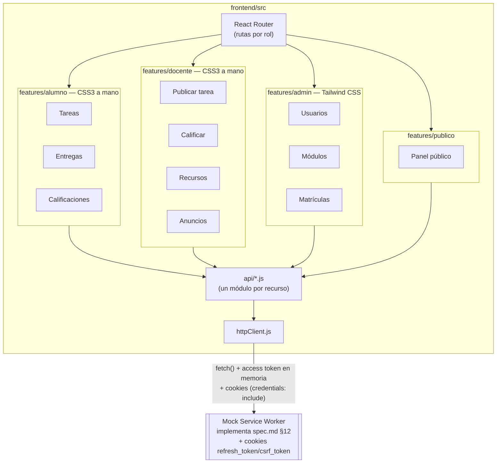

# Plan Técnico — 001 · Entorno Cliente (MF0491_3)

**Basado en:** `specs/000-funcional/spec.md` (HU, RF, contrato de API §12) · **Rige bajo:**
`memory/constitution.md` v3.0.0, Principios 3 (agnóstico a tecnología, ver
`docs/adr/0003-constitucion-agnostica-tecnologia.md`) y 5 (enmendados) · **Rama:** `feature/001-entorno-cliente`
**Unidad de competencia:** UC0491_3 — Desarrollar elementos software en el entorno cliente
**Fecha:** 2026-09-22 · revisado 2026-09-23 para alinear el cliente con `spec.md` v1.7 (TC.25–TC.30,
§6.2 y §6.3), en la rama `fix/alinear-cliente-spec-v1.7`

> Este módulo construye el cliente **completo y funcional** de las 9 HU de `spec.md`, contra una
> **API simulada** que implementa fielmente el contrato de `spec.md` §12. No depende de que
> `002-entorno-servidor` exista todavía — así se respeta el orden en que el certificado enseña
> primero MF0491_3 y después MF0492_3. La integración con el backend real es tarea explícita de
> `003-implantacion`, no de este módulo.

---

## 1. Alcance de este módulo

**Sí construye:** todas las vistas y flujos de las 9 HU para los 4 roles (visitante, alumno,
docente, administrador), consumiendo la API mockeada, con validación en cliente, accesibilidad
WCAG 2.2 AA y responsive mobile-first.

**No construye:** backend real, base de datos, autenticación real (el mock simula el flujo de
cookies + CSRF de `plan.md` §6 de `002-entorno-servidor` — cookies `HttpOnly` "falsas" emitidas por
MSW, sin verificación criptográfica real del JWT), despliegue a producción.

**Léase junto con:** `docs/adr/0001-frontend-react-tailwind.md` (por qué React + Tailwind híbrido)
y `spec.md` §11 (consecuencia sobre la trazabilidad con UC0491_3).

## 2. Stack tecnológico

| Pieza | Tecnología | Justificación |
|---|---|---|
| Framework | React 18 (componentes funcionales + hooks) | Ver ADR-0001. Valor de portfolio priorizado sobre vanilla JS. |
| Build tool | Vite | Arranque e HMR rápidos, configuración mínima, soporte nativo de ES modules. |
| Enrutado | React Router 6 | Enrutado declarativo por rol (`/admin/*`, `/docente/*`, `/alumno/*`, `/`) con rutas protegidas. |
| Estilos — admin | Tailwind CSS 3, `content` acotado a `src/features/admin/**` | Velocidad de construcción en las pantallas de gestión (tablas, formularios CRUD repetitivos). |
| Estilos — resto | CSS Modules (CSS3 escrito a mano) | Preserva alineación con UF1841 en las vistas de docente/alumno/público. |
| Cliente HTTP | `fetch` nativo envuelto en `src/api/httpClient.js` | Sin dependencia extra; un único punto para inyectar el header `Authorization: Bearer <access token en memoria>`, leer la cookie `csrf_token` y reenviarla como `X-CSRF-Token` en mutaciones, fijar `credentials: 'include'` (para que el navegador adjunte la cookie `refresh_token`) y mapear errores del contrato §12. |
| Mock de API | Mock Service Worker (MSW) | Intercepta las peticiones `fetch` a nivel de red (no de código), por lo que el cambio a la API real en `003-implantacion` es solo una variable de entorno, sin tocar componentes. |
| Formularios/validación | React Hook Form + validación propia según reglas de `spec.md` §6 (RF-002, RF-006) | Validación declarativa, mensajes de error accesibles (`aria-describedby`). |
| Pruebas unitarias/componentes | Vitest + React Testing Library | Estándar de facto en el ecosistema Vite/React. |
| Pruebas de accesibilidad | `@axe-core/react` en desarrollo + `vitest-axe` en CI | Cumple Constitución Principio 4 desde este módulo, no como tarea final. |
| Linting/formato | ESLint (config React + hooks) + Prettier + `eslint-plugin-tailwindcss` | El plugin de Tailwind ayuda a detectar clases mal usadas fuera de `features/admin`. |

**Criterios de decisión (Principio 3 v3.0.0):** alineación con el certificado — React se elige
explícitamente por valor de portfolio (OB-5), no por fidelidad literal a UC0491_3/UF1842; la
tensión se explicita en `spec.md` §11 y `docs/adr/0001-frontend-react-tailwind.md` (deuda
consciente, no silenciada); madurez/LTS — React 18 y Vite son ecosistema estándar de facto;
coherencia con Principio 2 — el cliente solo habla con el backend por la API REST de `spec.md`
§12, mock incluido; no compromete Principios 4/5/6 — `vitest-axe`/`@axe-core/react` desde este
módulo (Principio 4), diseño de sesión fiel al real en el mock (Principio 5, ver `plan.md` §6),
Vitest + RTL para el umbral de pruebas (Principio 6); frontera de estilos — Tailwind acotado por
`content` a `features/admin/**`, ver §5.

**Reversibilidad:** sustituible sin rediseño — React Hook Form (→ otra librería de formularios),
MSW (→ otro *mocking* de red, mientras respete el contrato §12), ESLint/Prettier. Estructural —
React como framework (toda la estructura de `features/`, `AuthContext`, `RutaProtegida` asume sus
hooks), Vite como *build tool* (scripts de `package.json` y variables `VITE_*` lo asumen), la
frontera Tailwind/CSS3 de §5 (cambiarla implica reescribir el CSS de medio proyecto).

## 3. Arquitectura del cliente



## 4. Estructura de carpetas

```
frontend/
├── package.json
├── vite.config.js
├── tailwind.config.js          # content: ["./src/features/admin/**/*.{jsx,js}"]
├── postcss.config.js
├── index.html
├── src/
│   ├── main.jsx
│   ├── App.jsx                  # Router raíz + rutas protegidas por rol
│   ├── api/
│   │   ├── httpClient.js        # fetch + Authorization (access token en memoria) + X-CSRF-Token
│   │   │                        # (leído de cookie csrf_token) + credentials:'include' + mapeo §12
│   │   ├── authApi.js
│   │   ├── modulosApi.js
│   │   ├── tareasApi.js
│   │   ├── entregasApi.js
│   │   ├── evaluacionesApi.js
│   │   ├── recursosApi.js
│   │   ├── anunciosApi.js
│   │   ├── adjuntosApi.js       # descarga autenticada (Blob + URL de objeto), §6.1
│   │   └── cicloApi.js          # GET/PUT /ciclo (RF-019), TC.27
│   ├── mocks/
│   │   ├── browser.js            # arranque de MSW en dev
│   │   ├── handlers/              # un handler por recurso, fiel a spec.md §12
│   │   └── fixtures/              # datos de ejemplo (usuarios, módulos, tareas...)
│   ├── auth/
│   │   ├── AuthContext.jsx        # access token en memoria (nunca localStorage), rol activo,
│   │   │                          # renovación automática contra /auth/refresh al arrancar
│   │   └── RutaProtegida.jsx      # componente de guardia por rol
│   ├── features/
│   │   ├── publico/
│   │   │   └── PanelPublico.jsx
│   │   ├── alumno/
│   │   │   ├── alumno.module.css
│   │   │   ├── ListaTareas.jsx
│   │   │   ├── FormularioEntrega.jsx
│   │   │   └── MisCalificaciones.jsx
│   │   ├── docente/
│   │   │   ├── docente.module.css
│   │   │   ├── FormularioTarea.jsx
│   │   │   ├── ListaEntregas.jsx
│   │   │   ├── FormularioCalificacion.jsx
│   │   │   ├── FormularioRecurso.jsx
│   │   │   └── FormularioAnuncio.jsx
│   │   └── admin/                 # única carpeta donde se usan clases Tailwind
│   │       ├── TablaUsuarios.jsx
│   │       ├── FormularioModulo.jsx
│   │       ├── FormularioCiclo.jsx    # horario y requisitos de acceso (RF-019), TC.27
│   │       └── GestionMatriculas.jsx
│   ├── components/
│   │   └── compartidos/           # botones, inputs, alertas — CSS3 a mano, reutilizables en todas las áreas
│   │                              # (incluye ConfirmacionBorrado.jsx, §7, TC.29)
│   ├── utils/
│   │   ├── fechas.js              # formato y conversión hora peninsular ↔ UTC (RNF-010), §6.2
│   │   ├── adjuntos.js            # límites de RNF-014, compartidos con el mock
│   │   ├── password.js            # reglas de RF-018, compartidas con el mock
│   │   └── cookies.js
│   └── styles/
│       ├── variables.css          # tokens de color/tipografía (:root)
│       └── base.css               # reset, tipografía base
└── tests/
    ├── setup.js                  # jest-dom / vitest-axe
    └── (specs de Vitest junto a cada componente, *.test.jsx)
```

## 5. Reglas de la frontera Tailwind / CSS3

1. `tailwind.config.js` declara `content: ["./src/features/admin/**/*.{jsx,js}"]` exclusivamente.
   Una clase Tailwind escrita en `features/alumno` o `features/docente` no se generará en el CSS
   final: el fallo es silencioso en build pero visible a simple vista en la UI (sin estilo), y se
   detecta también por `eslint-plugin-tailwindcss` configurado para marcar error, no warning,
   fuera de `features/admin`.
2. `components/compartidos/` (botones, inputs, alertas reutilizados en todas las áreas) se estilan
   con CSS3 a mano — son el "vocabulario visual" común y no deben depender de Tailwind para no
   forzar su import en áreas no-admin.
3. Cualquier excepción a esta frontera requiere justificación explícita en el PR, citando el
   Principio 3 de la constitución.

## 6. Sesión y CSRF en el mock (MSW)

> Diseño real fijado en `docs/adr/0002-seguridad-sesion-y-datos.md` y en `plan.md` §6 de
> `002-entorno-servidor`; este módulo lo **simula fielmente** con MSW para que la migración de
> `003-implantacion` (apuntar a la API real) no requiera tocar componentes ni `AuthContext.jsx`.

- El handler de `POST /auth/login` en MSW responde con el access token en el **cuerpo** JSON y dos
  cabeceras `Set-Cookie` simuladas: `refresh_token` (marcada `HttpOnly` en la respuesta mockeada,
  aunque MSW no puede impedir su lectura en JS del propio test — se documenta como limitación
  conocida del mock, no del diseño real) y `csrf_token` (legible).
- `AuthContext.jsx` guarda el access token **solo en una variable de estado de React** — nunca en
  `localStorage`/`sessionStorage` — y lo pierde al recargar la página, igual que en el diseño real;
  al arrancar, llama a `POST /auth/refresh` (mockeado) para recuperar sesión si la cookie de
  refresh simulada sigue "vigente" en el estado de MSW.
- `httpClient.js` lee `document.cookie` para extraer `csrf_token` y lo reenvía como
  `X-CSRF-Token` en toda petición `POST`/`PUT`/`DELETE`; los handlers de MSW para esos verbos
  responden `403` si la cabecera no coincide con la cookie emitida, replicando el comportamiento
  real del servidor (`plan.md` §6 de `002-entorno-servidor`) para que las pruebas de este módulo
  detecten un `httpClient.js` mal implementado antes de llegar a `003-implantacion`.
- Ningún componente de `features/*` conoce el mecanismo de cookies/CSRF directamente: solo
  `httpClient.js` y `AuthContext.jsx` lo implementan, así que el cambio a la API real en
  `003-implantacion` no toca `features/*`.

### 6.1 Adjuntos y cambio obligatorio de contraseña en el mock

- Los formularios con fichero envían `FormData`; `httpClient.js` no fija `Content-Type` en ese
  caso para que el navegador añada el `boundary` del `multipart/form-data`.
- La descarga (`GET /adjuntos/{id}`) no puede ser un `<a href>` plano porque necesita la cabecera
  `Authorization`: `adjuntosApi.js` la pide con `httpClient`, recibe un `Blob` y lo abre con una URL
  de objeto temporal, que se revoca al terminar.
- El mock guarda los ficheros en memoria (se pierden al recargar, igual que el resto de datos del
  mock) y valida tamaño y tipo declarado; la comprobación del tipo por contenido real es
  responsabilidad del servidor de `002`.
- `AuthContext.jsx` expone `debeCambiarPassword` (viene en el usuario de `/auth/login` y
  `/auth/refresh`); mientras sea `true`, `RutaProtegida.jsx` redirige toda ruta protegida a
  `/cambiar-password` (`auth/PaginaCambiarPassword.jsx`, CSS Module de `auth/`).

### 6.2 Fechas y zona horaria (RNF-010, TC.26)

- **Una sola puerta:** ningún componente llama a `toLocaleString` ni construye fechas a mano; todo
  pasa por `src/utils/fechas.js`:
  - `formatearFechaHora(iso)` → `dd/mm/aaaa hh:mm` en `Europe/Madrid` con `Intl.DateTimeFormat`
    (`timeZone: 'Europe/Madrid'`), independientemente de la zona del navegador.
  - `horaPeninsularAUtc(valorDatetimeLocal)` → convierte lo que teclea el docente en un
    `<input type="datetime-local">` (hora peninsular, sin zona) a ISO 8601 en UTC con `Z`.
  - `utcAValorDatetimeLocal(iso)` → la inversa, para precargar el formulario al editar una tarea.
- **Sin dependencias nuevas:** se usa la API `Intl` del navegador. La conversión calcula el
  desfase de `Europe/Madrid` para ese instante con `Intl.DateTimeFormat#formatToParts`, en dos
  pasadas para acertar en los días de cambio de hora. Añadir una librería de fechas (p. ej.
  `date-fns-tz`) solo por tres funciones no compensa un paquete más que mantener (Principio 3,
  criterio de reversibilidad: se puede sustituir sin tocar componentes, porque todo pasa por
  `fechas.js`).
- **Días de cambio de hora:** una hora que no existe (el último domingo de marzo, de 2:00 a 2:59)
  se desplaza hacia delante una hora; una hora que se repite (el último domingo de octubre, de
  2:00 a 2:59) se interpreta como la primera de las dos. Es la regla habitual de las librerías de
  fechas (la opción `compatible` de la API `Temporal`) y queda cubierta por pruebas.
- La validación «fecha límite futura» del formulario compara instantes en UTC (`Date.now()` frente
  al valor convertido), no cadenas de texto.

### 6.3 Reglas del mock para la spec v1.6/v1.7 (TC.25, TC.27–TC.30)

- **Estados:** las entregas tienen `estado` `ENTREGADA`/`CALIFICADA` y `fueraDePlazo` aparte; las
  tareas no tienen `estado`. El mock calcula el plazo con la hora del propio mock (`new Date()`),
  con la igualdad exacta dentro de plazo, y conserva `fueraDePlazo` al calificar.
- **Tareas:** ampliar la fecha límite recalcula `fueraDePlazo` de sus entregas; acortarla con
  entregas o borrar una tarea con entregas → `409` con los mensajes de la spec.
- **Quién no ha entregado:** `GET /tareas/{id}/entregas` devuelve `{ entregas, sinEntregar }`,
  calculando `sinEntregar` con las matrículas `ACTIVA` del módulo.
- **Ciclo:** `db.ciclo` (un único objeto, sembrado desde `fixtures/ciclo.js`), `GET /ciclo`
  público y `PUT /ciclo` solo para el ADMINISTRADOR; los módulos llevan `descripcion`.
- **Acceso:** `alumnoMatriculadoEnModulo` pasa a leer `db.matriculas` (hoy lee los fixtures, así
  que revocar una matrícula en `npm run dev` no tiene efecto); con la matrícula en `BAJA`, `403`
  en tareas, recursos, anuncios y al entregar, y `200` en calificaciones y adjuntos propios.
- **Baja de usuario:** `DELETE /usuarios/{id}` marca como revocadas las sesiones de refresco de
  ese usuario y `obtenerSesion` ya rechaza a usuarios inactivos, así que su siguiente petición da
  `401`; la baja de un docente responsable de un módulo → `409`.

## 7. Accesibilidad (WCAG 2.2 AA) en este módulo

- Todo formulario usa `<label htmlFor>` asociado, `aria-describedby` para mensajes de error, y
  foco gestionado explícitamente al mostrar errores de validación.
- Navegación completa por teclado verificada manualmente en cada HU antes de dar la tarea por
  cerrada (no solo automatizada — axe-core no detecta todos los problemas de orden de tabulación).
- Contraste mínimo 4.5:1 verificado en `styles/variables.css` (tokens de color) antes de usarlos
  en cualquier componente.
- `vitest-axe` se ejecuta contra cada componente de página completa (no solo átomos) en CI.
- **Confirmación de borrado (TC.29):** `components/compartidos/ConfirmacionBorrado.jsx` muestra la
  pregunta dentro de la página, junto al elemento, con los botones «Borrar» y «Cancelar». Al
  aparecer, el foco va a «Cancelar» (la opción segura); `Escape` cancela y devuelve el foco al botón
  que la abrió. No se usa `window.confirm`: no se puede estilizar ni probar, y bloquea la página.
- **Fechas legibles:** todas las fechas visibles pasan por `formatearFechaHora` (§6.2), así que un
  lector de pantalla lee siempre el mismo formato `dd/mm/aaaa hh:mm`.

## 8. Plan de pruebas de este módulo

| Tipo | Herramienta | Alcance | Umbral |
|---|---|---|---|
| Componentes | Vitest + React Testing Library | Cada componente de `features/*` con lógica (formularios, listas con estado) | 1+ test de render + 1 de interacción por componente |
| Accesibilidad | `vitest-axe` | Cada página completa de `features/*` | 0 violaciones críticas/serias |
| Contrato mock ↔ spec | Revisión manual + test de humo | `mocks/handlers/` contra la tabla de `spec.md` §12 | Cada endpoint del contrato tiene un handler equivalente |
| Visual/responsive | Verificación manual en 480/768/1024px | Todas las páginas | Sin scroll horizontal, sin solapes |
| Fechas (RNF-010) | Vitest, con `TZ=America/New_York` en un script propio (`npm run test:tz`) | `utils/fechas.js` y el envío de la fecha límite | Mismo resultado en cualquier zona del entorno; días de cambio de hora cubiertos |

## 9. Salida de este módulo (Definition of Done)

- Las 9 HU de `spec.md` son ejecutables de principio a fin contra el mock, para los 4 roles.
- `npm run build` genera un bundle de producción sin errores.
- `npm run test` y `npm run test:a11y` en verde en CI.
- README del módulo (`frontend/README.md`) explica cómo arrancar con el mock y cómo se sustituirá
  por la API real en `003-implantacion` (variable `VITE_API_BASE_URL` + desactivar MSW).
