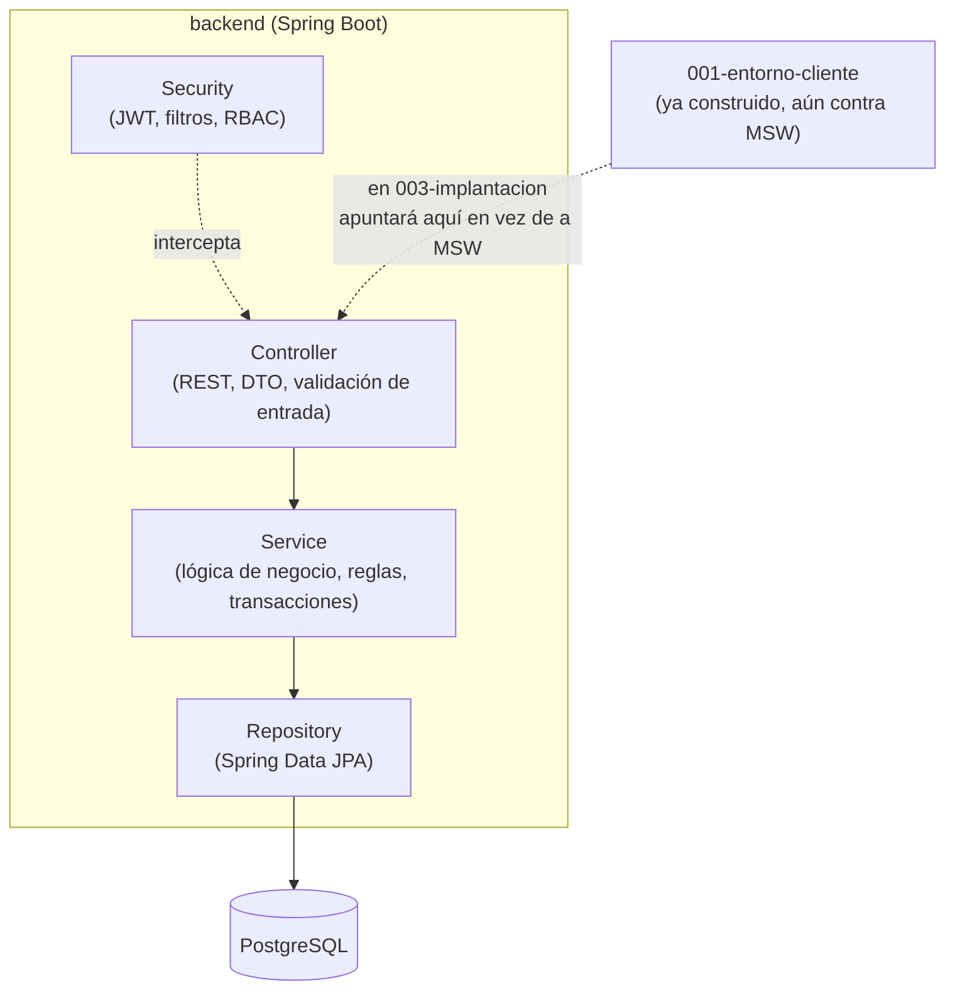

# Plan Técnico — 002 · Entorno Servidor (MF0492_3)

**Basado en:** `specs/000-funcional/spec.md` (RF, modelo de datos §8, contrato de API §12) ·
**Rige bajo:** `memory/constitution.md` v3.0.0, Principio 3 (agnóstico a tecnología, ver
`docs/adr/0003-constitucion-agnostica-tecnologia.md`) · **Rama:** `feature/002-entorno-servidor`
(se abre desde `develop` **solo tras mergear** `feature/001-entorno-cliente`)
**Unidad de competencia:** UC0492_3 — Desarrollar elementos software en el entorno servidor
**Fecha:** 2026-09-22

> Este módulo implementa el backend real que satisface exactamente el contrato de
> `spec.md` §12 — el mismo que `001-entorno-cliente` ya consumió simulado con MSW. No se cambia el
> contrato aquí: un endpoint, código de estado o forma de DTO distintos a los ya acordados es un
> cambio de spec (`specs/000-funcional/spec.md`), no de este plan.

---

## 1. Alcance de este módulo

**Sí construye:** API REST completa, persistencia PostgreSQL, autenticación JWT real, autorización
RBAC, lógica de negocio de las 15 RF, documentación OpenAPI generada desde el código.

**No construye:** frontend (ya existe desde `001-entorno-cliente`, sin tocarlo todavía),
integración cliente-servidor real, despliegue a producción, pruebas E2E cruzadas — todo eso es
`003-implantacion`.

## 2. Stack tecnológico

| Capa | Tecnología | Justificación |
|---|---|---|
| Lenguaje/Framework | Java 17 (LTS) + Spring Boot 3.3.x | Tipado fuerte, ecosistema de pruebas maduro, encaje 1:1 con UC0492_3 (POO, MVC, patrones). Decisión sin cambios respecto al stack original; desde constitución v3.0.0 se documenta y justifica aquí (Principio 3 ya no nombra tecnologías, ver criterios de decisión más abajo). |
| Persistencia | PostgreSQL 16 | Motor relacional open-source robusto, tipos `UUID`/`JSONB`, buen encaje con Flyway y UF1845 (SQL estándar, normalización). |
| ORM / acceso a datos | Spring Data JPA + Hibernate | Mapea UF1845 (modelo lógico → físico) reduciendo SQL repetitivo sin perder control fino (`@Query` nativo cuando hace falta). |
| Migraciones | Flyway | Esquema versionado junto al código (Constitución Principio 7). |
| Autenticación | Spring Security + JWT (jjwt) | Stateless, escalable horizontalmente. |
| Documentación de API | springdoc-openapi (Swagger UI) | Generada desde el propio código (Principio 7); se valida contra el contrato de `spec.md` §12 en CI (ver §7). |
| Pruebas | JUnit 5, Mockito, Testcontainers, JaCoCo | Estándar del ecosistema Spring; Testcontainers para integración contra PostgreSQL real. |

**Criterios de decisión (Principio 3 v3.0.0):** alineación con el certificado — Java/Spring Boot
encaja 1:1 con UC0492_3 (POO, MVC, patrones), se imparte Java/SQL en el ciclo; madurez/LTS — Java
17 LTS, Spring Boot 3.x rama estable, ecosistema de pruebas maduro (JUnit5/Mockito/Testcontainers);
coherencia con Principio 2 — la API REST es la única frontera, ningún elemento del stack la
difumina; no compromete Principios 4/5/6 — Spring Security + Bean Validation + JaCoCo cubren
accesibilidad indirecta (RNF-009 i18n de mensajes), seguridad (Principio 5) y cobertura (≥70%) sin
tensión conocida.

**Reversibilidad:** sustituible sin rediseño — motor de base de datos (PostgreSQL → otro RDBMS
soportado por JPA/Flyway, con migración de tipos `UUID`/`JSONB`), librería JWT (`jjwt` → otra
implementación de JWT), Testcontainers → otro mecanismo de BD efímera para pruebas. Estructural —
Java + Spring Boot como framework base (toda la arquitectura de capas, `@PreAuthorize`, Spring Data
JPA y los filtros de seguridad del §6 asumen Spring); Spring Data JPA como capa de acceso a datos
(cambiarlo implica reescribir `repository/` y `domain/` enteros, no un PR aislado).

## 3. Arquitectura (MVC en el servidor)



- **Modelo:** entidades JPA (`domain/`) + DTOs de entrada/salida (`dto/`); el modelo nunca se
  serializa directamente (evita exponer `passwordHash`, entre otros).
- **Vista:** la respuesta JSON de la API REST — no hay motor de plantillas server-side (Constitución
  Principio 2: cliente y servidor separados).
- **Controlador:** clases `@RestController`, responsables únicamente de mapear HTTP ↔ DTO ↔
  llamada a `Service`, sin lógica de negocio.

## 4. Estructura de carpetas

```
backend/
├── pom.xml
├── Dockerfile
├── src/
│   ├── main/
│   │   ├── java/com/gestorfp/
│   │   │   ├── GestorFpApplication.java
│   │   │   ├── config/            # SecurityConfig, OpenApiConfig, CorsConfig
│   │   │   ├── controller/        # UsuarioController, ModuloController, TareaController...
│   │   │   ├── service/           # UsuarioService, TareaService, EvaluacionService...
│   │   │   ├── repository/        # Interfaces Spring Data JPA
│   │   │   ├── domain/            # Entidades JPA: Usuario, Modulo, Tarea, Entrega...
│   │   │   ├── dto/                # Request/Response DTOs (fieles al contrato §12)
│   │   │   ├── security/          # JwtFilter, JwtService, UserDetailsServiceImpl
│   │   │   ├── exception/         # GlobalExceptionHandler, excepciones de dominio
│   │   │   └── validation/        # Validadores custom (@FechaFutura, @RangoCalificacion)
│   │   └── resources/
│   │       ├── application.yml
│   │       ├── application-dev.yml
│   │       ├── application-pre.yml
│   │       ├── application-prod.yml
│   │       └── db/migration/      # Flyway: V1__init_schema.sql, V2__seed_roles_demo.sql...
│   └── test/
│       └── java/com/gestorfp/
│           ├── service/           # Pruebas unitarias (Mockito)
│           ├── controller/        # Pruebas de integración (MockMvc)
│           └── repository/        # Pruebas de integración (Testcontainers)
```

## 5. Esquema de base de datos

Deriva del modelo conceptual de `spec.md` §8. Claves primarias `UUID`. Índices sobre claves
foráneas y sobre columnas con restricción de unicidad.

| Tabla | Índices relevantes | Notas |
|---|---|---|
| `usuarios` | `UNIQUE(email)` | `rol` como `VARCHAR` + `CHECK` (simplifica migraciones frente a `enum` nativo) |
| `modulos` | `UNIQUE(codigo)`, `INDEX(docente_responsable_id)` | |
| `unidades_formativas` | `INDEX(modulo_id)`, `UNIQUE(modulo_id, codigo)` | |
| `matriculas` | `UNIQUE(alumno_id, modulo_id)`, `INDEX(modulo_id)` | Evita doble matrícula activa |
| `tareas` | `INDEX(unidad_formativa_id)`, `INDEX(fecha_limite)` | |
| `entregas` | `UNIQUE(tarea_id, alumno_id)`, `INDEX(alumno_id)` | Una entrega por alumno y tarea |
| `evaluaciones` | `UNIQUE(entrega_id)` | Relación 1–1 con `entregas` |
| `recursos` | `INDEX(unidad_formativa_id)` | |
| `anuncios` | `INDEX(modulo_id)`, `INDEX(destacado)` | |
| `tokens_revocados` | `UNIQUE(jti)`, `INDEX(fecha_expiracion)` | Blacklist de replay (Constitución Principio 5 / ADR-0002); columnas `jti` (String), `fecha_expiracion` (timestamp, igual a la expiración original del JWT). Sin Redis: PostgreSQL es la única fuente de verdad. `INDEX(fecha_expiracion)` soporta el job periódico de limpieza (ver `tasks.md`) |

Migraciones: `V1__init_schema.sql` (tablas + índices), `V2__seed_roles_demo.sql` (datos de
demostración, solo perfil `dev`), `V3__tokens_revocados.sql` (tabla de blacklist de JWT).

> Nota: la tabla de adjuntos (`ficheroUrl` en `entregas`/`recursos`) asume por ahora una URL de
> texto libre. El mecanismo real de almacenamiento (disco vs. objeto) es la consideración abierta
> **CA-01** de `spec.md` §13 — bloquea la tarea correspondiente hasta que se decida (ver `tasks.md`).

## 6. Autenticación y autorización

> Diseño fijado por **CA-03/CA-04 resueltas** (`spec.md` §13) y Constitución Principio 5 v2.1.0;
> justificación completa y alternativas descartadas (JWT en `localStorage`, Redis) en
> `docs/adr/0002-seguridad-sesion-y-datos.md`.

- `POST /auth/login` valida email + contraseña (BCrypt, coste ≥ 10) contra `/auth/login`, limitado
  por **Bucket4j** con clave compuesta IP+usuario (`429` a partir de 5 intentos fallidos en 15 min,
  sin Redis — bucket en memoria de la instancia; ver nota de escalado horizontal en `tasks.md`).
- Si las credenciales son válidas, el servidor emite:
  - **Access token JWT** (expiración 15 min, claim `jti` único) devuelto en el **cuerpo** de la
    respuesta — el cliente lo guarda en memoria, nunca en `localStorage`.
  - **Refresh token** en una cookie `Set-Cookie: refresh_token=...; HttpOnly; Secure;
    SameSite=Strict; Path=/auth` (7 días), hasheado en BD para poder revocarlo/verificarlo.
  - **Token CSRF** en una segunda cookie `Set-Cookie: csrf_token=...; Secure; SameSite=Strict`
    (**no** `HttpOnly`: el cliente debe poder leerla desde JS para reenviarla como cabecera).
- `POST /auth/refresh` lee la cookie `refresh_token`, valida contra BD, y si es válida emite un
  nuevo access token (rotación de `jti`) y renueva la cookie `refresh_token`.
- `POST /auth/logout` inserta el `jti` del access token vigente (y, si se envía, el hash del
  refresh token) en `tokens_revocados`, y borra ambas cookies (`Max-Age=0`).
- **Filtro de replay:** un `OncePerRequestFilter` de Spring Security, tras validar la firma y
  expiración del JWT, comprueba que su `jti` **no** esté en `tokens_revocados` antes de dejar pasar
  la petición; si está, `401`.
- **CSRF (doble token):** un filtro dedicado exige, en toda petición `POST`/`PUT`/`DELETE`
  autenticada por cookie, que la cabecera `X-CSRF-Token` coincida con el valor de la cookie
  `csrf_token`; si no coincide o falta, `403`. Las peticiones autenticadas solo por el access token
  en cabecera `Authorization: Bearer` (si en algún punto se usan fuera del navegador, p. ej.
  pruebas automatizadas) quedan exentas de esta comprobación al no depender de cookies.
- RBAC declarativo con `@PreAuthorize("hasRole('DOCENTE')")` combinado con comprobación de
  **propiedad del recurso** en `service` (un DOCENTE solo califica entregas de módulos que
  imparte; un ALUMNO solo ve sus propias calificaciones) — Constitución Principio 5: un rol
  correcto no basta si el recurso no es del usuario autenticado; cada endpoint sensible lleva una
  prueba de `403` cuando la propiedad no se cumple.
- CORS restringido al origen del `frontend` por entorno, con `Access-Control-Allow-Credentials:
  true` (obligatorio para que el navegador envíe las cookies de sesión entre orígenes en
  desarrollo).
- Cabeceras de seguridad: CSP, `X-Content-Type-Options: nosniff`, `X-Frame-Options: DENY`,
  `Strict-Transport-Security` (activadas en este módulo; endurecidas en `003-implantacion`).
- **Protección de datos (RGPD, RNF-013):** sin cifrado de columna (pgcrypto descartado); se asume
  cifrado de disco a nivel de infraestructura de despliegue (`003-implantacion`). El servicio de
  baja lógica de `Usuario` expone un método de anonimización (sustituye
  `nombre`/`apellidos`/`email` por valores no identificables, conserva `id`/`rol`) invocable
  manualmente — no automático, a la espera de que se resuelva el plazo de retención (`spec.md`
  CA-05, aún abierta).

## 7. Verificación de conformidad con el contrato (§12)

Antes de cerrar este módulo, `docs/openapi-generado.json` (exportado de springdoc en tiempo de
build) se compara manualmente endpoint por endpoint contra `spec.md` §12: mismos métodos, mismas
rutas, mismos roles, mismos códigos de éxito. Cualquier discrepancia se resuelve actualizando el
código para ajustarse al contrato — el contrato no se toca desde este módulo (Principio 1).

## 8. Plan de pruebas de este módulo

| Tipo | Herramienta | Alcance | Umbral |
|---|---|---|---|
| Unitarias | JUnit 5 + Mockito | Capa `service` | Cobertura ≥ 70% (JaCoCo) |
| Integración | `@SpringBootTest` + MockMvc + Testcontainers (PostgreSQL) | Controladores + repositorios | Cada endpoint de §12 con 1 caso de éxito + 1 de error |
| Contrato | Comparación manual OpenAPI generado vs. `spec.md` §12 | Coherencia API | 0 discrepancias sin justificar |
| Seguridad | Revisión manual de RBAC por endpoint | Cada endpoint con rol restringido | Prueba de acceso denegado (403) para cada rol no autorizado |

## 9. Salida de este módulo (Definition of Done)

- Los 23 endpoints de `spec.md` §12 implementados y probados.
- Cobertura `service` ≥ 70% en CI.
- `/swagger-ui.html` navegable en perfil `dev`.
- `docker compose up` (backend + PostgreSQL) levanta el sistema con datos de seed.
- Contrato verificado contra §12 sin discrepancias abiertas.
