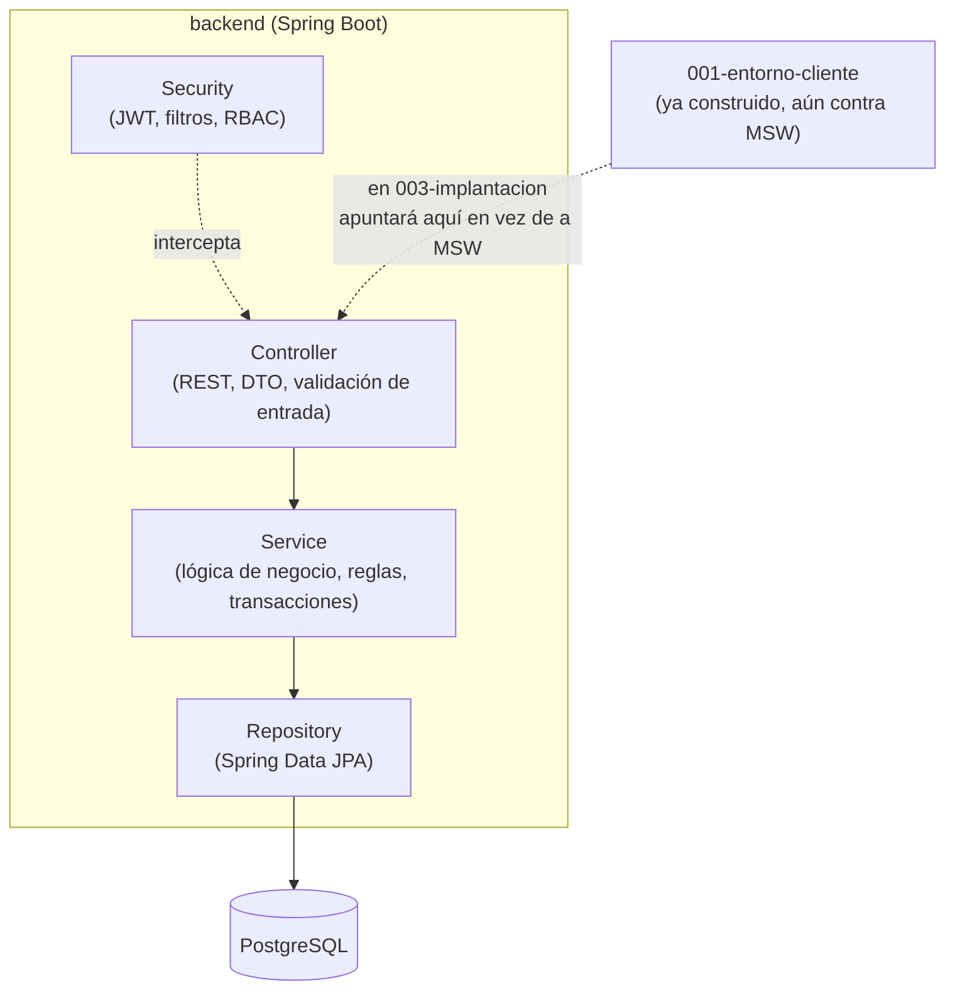

# Plan Técnico — 002 · Entorno Servidor (MF0492_3)

**Basado en:** `specs/000-funcional/spec.md` (RF, modelo de datos §8, contrato de API §12) ·
**Rige bajo:** `memory/constitution.md` v3.0.0, Principio 3 (agnóstico a tecnología, ver
`docs/adr/0003-constitucion-agnostica-tecnologia.md`) · **Rama:** `feature/002-entorno-servidor`
(se abre desde `develop` **solo tras mergear** `feature/001-entorno-cliente`)
**Unidad de competencia:** UC0492_3 — Desarrollar elementos software en el entorno servidor
**Fecha:** 2026-09-22 · revisado 2026-09-23 contra `spec.md` v1.7 (hallazgos CRITICAL/HIGH de
`/speckit-analyze`: CSRF, contraseñas, historial, `fueraDePlazo`, zona horaria, baja inmediata,
adjuntos, ciclo, edición/borrado, matrícula en baja, Javadoc)

> Este módulo implementa el backend real que satisface exactamente el contrato de
> `spec.md` §12 — el mismo que `001-entorno-cliente` ya consumió simulado con MSW. No se cambia el
> contrato aquí: un endpoint, código de estado o forma de DTO distintos a los ya acordados es un
> cambio de spec (`specs/000-funcional/spec.md`), no de este plan.

---

## 1. Alcance de este módulo

**Sí construye:** API REST completa, persistencia PostgreSQL, autenticación JWT real, autorización
RBAC, lógica de negocio de las 19 RF (RF-001–RF-019), almacenamiento de adjuntos en volumen
persistente (RNF-014), documentación OpenAPI generada desde el código.

**No construye:** frontend (ya existe desde `001-entorno-cliente`, sin tocarlo todavía),
integración cliente-servidor real, despliegue a producción, pruebas E2E cruzadas — todo eso es
`003-implantacion`.

## 2. Stack tecnológico

| Capa | Tecnología | Justificación |
|---|---|---|
| Lenguaje/Framework | Java 17 (LTS) + Spring Boot 3.3.x | Tipado fuerte, ecosistema de pruebas maduro, encaje 1:1 con UC0492_3 (POO, MVC, patrones). Decisión sin cambios respecto al stack original; desde constitución v3.0.0 se documenta y justifica aquí (Principio 3 ya no nombra tecnologías, ver criterios de decisión más abajo). |
| Persistencia | PostgreSQL 16 | Motor relacional open-source robusto, tipos `UUID`/`JSONB`, buen encaje con Flyway y UF1845 (SQL estándar, normalización). |
| ORM / acceso a datos | Spring Data JPA + Hibernate | Mapea UF1845 (modelo lógico → físico) reduciendo SQL repetitivo sin perder control fino (`@Query` nativo cuando hace falta). |
| Migraciones | Flyway | Esquema versionado junto al código (Constitución Principio 7). |
| Autenticación | Spring Security + JWT (jjwt) | Stateless, escalable horizontalmente. |
| Documentación de API | springdoc-openapi (Swagger UI) | Generada desde el propio código (Principio 7); se valida contra el contrato de `spec.md` §12 en CI (ver §7). |
| Pruebas | JUnit 5, Mockito, Testcontainers, JaCoCo | Estándar del ecosistema Spring; Testcontainers para integración contra PostgreSQL real. |
| Tipo real de los adjuntos | Apache Tika (`tika-core`) | RNF-014 exige comprobar el tipo por el **contenido**, no por la extensión ni por el `Content-Type` que declara el cliente. `tika-core` detecta el tipo por la firma de los primeros bytes, sin dependencias nativas ni servicio externo. |
| Javadoc obligatorio | Maven Checkstyle Plugin (regla `MissingJavadocType`) | La constitución (Principio 7) exige Javadoc en las clases públicas de `service` y `controller`; la regla lo comprueba en `mvn verify` y hace fallar el build si falta, en lugar de depender de una revisión manual. |

**Criterios de decisión (Principio 3 v3.0.0):** alineación con el certificado — Java/Spring Boot
encaja 1:1 con UC0492_3 (POO, MVC, patrones), se imparte Java/SQL en el ciclo; madurez/LTS — Java
17 LTS, Spring Boot 3.x rama estable, ecosistema de pruebas maduro (JUnit5/Mockito/Testcontainers);
coherencia con Principio 2 — la API REST es la única frontera, ningún elemento del stack la
difumina; no compromete Principios 4/5/6 — Spring Security + Bean Validation + JaCoCo cubren
accesibilidad indirecta (RNF-010, mensajes de validación en español), seguridad (Principio 5) y cobertura (≥70%) sin
tensión conocida.

**Reversibilidad:** sustituible sin rediseño — motor de base de datos (PostgreSQL → otro RDBMS
soportado por JPA/Flyway, con migración de tipos `UUID`/`JSONB`), librería JWT (`jjwt` → otra
implementación de JWT), Testcontainers → otro mecanismo de BD efímera para pruebas, `tika-core` →
otro detector de tipo por firma (queda detrás de `DetectorTipoFichero`), Checkstyle → otra
herramienta de análisis estático. Estructural —
Java + Spring Boot como framework base (toda la arquitectura de capas, `@PreAuthorize`, Spring Data
JPA y los filtros de seguridad del §6 asumen Spring); Spring Data JPA como capa de acceso a datos
(cambiarlo implica reescribir `repository/` y `domain/` enteros, no un PR aislado).

## 3. Arquitectura (MVC en el servidor)



- **Modelo:** entidades JPA (`domain/`) + DTOs de entrada/salida (`dto/`); el modelo nunca se
  serializa directamente (evita exponer `passwordHash`, entre otros).
- **Vista:** la respuesta JSON de la API REST — no hay motor de plantillas server-side (Constitución
  Principio 2: cliente y servidor separados).
- **Controlador:** clases `@RestController`, responsables únicamente de mapear HTTP ↔ DTO ↔
  llamada a `Service`, sin lógica de negocio.

## 4. Estructura de carpetas

```
backend/
├── pom.xml
├── Dockerfile
├── src/
│   ├── main/
│   │   ├── java/com/gestorfp/
│   │   │   ├── GestorFpApplication.java
│   │   │   ├── config/            # SecurityConfig, OpenApiConfig, CorsConfig
│   │   │   ├── controller/        # UsuarioController, ModuloController, TareaController...
│   │   │   ├── service/           # UsuarioService, TareaService, EvaluacionService...
│   │   │   ├── repository/        # Interfaces Spring Data JPA
│   │   │   ├── domain/            # Entidades JPA: Usuario, Modulo, Tarea, Entrega...
│   │   │   ├── dto/                # Request/Response DTOs (fieles al contrato §12)
│   │   │   ├── security/          # JwtFilter, JwtService, UserDetailsServiceImpl
│   │   │   ├── exception/         # GlobalExceptionHandler, excepciones de dominio
│   │   │   └── validation/        # Validadores custom (@FechaFutura, @RangoCalificacion, @PasswordSegura)
│   │   └── resources/
│   │       ├── application.yml
│   │       ├── application-dev.yml
│   │       ├── application-pre.yml
│   │       ├── application-prod.yml
│   │       ├── db/migration/      # Flyway, todos los perfiles: V1__init_schema.sql, V3__tokens_revocados.sql
│   │       └── db/seed-dev/       # Flyway, solo perfil dev: V2__seed_roles_demo.sql (§5)
│   └── test/
│       └── java/com/gestorfp/
│           ├── service/           # Pruebas unitarias (Mockito)
│           ├── controller/        # Pruebas de integración (MockMvc)
│           └── repository/        # Pruebas de integración (Testcontainers)
```

## 5. Esquema de base de datos

Deriva del modelo conceptual de `spec.md` §8. Claves primarias `UUID`. Índices sobre claves
foráneas y sobre columnas con restricción de unicidad.

| Tabla | Índices relevantes | Notas |
|---|---|---|
| `usuarios` | `UNIQUE(email)` | `rol` como `VARCHAR` + `CHECK` (simplifica migraciones frente a `enum` nativo); `debe_cambiar_password BOOLEAN NOT NULL` (RF-017: `true` tras el alta o un restablecimiento) |
| `ciclo` | Clave primaria fija (un único registro) | RF-019: `horario TEXT`, `requisitos_acceso TEXT`, `fecha_modificacion`. La migración inserta el registro único; el servicio solo lo actualiza (no hay alta ni borrado) |
| `modulos` | `UNIQUE(codigo)`, `INDEX(docente_responsable_id)` | `descripcion TEXT` (RF-011, v1.7) |
| `unidades_formativas` | `INDEX(modulo_id)`, `UNIQUE(modulo_id, codigo)` | |
| `matriculas` | Índice único **parcial** `UNIQUE(alumno_id, modulo_id) WHERE estado = 'ACTIVA'`, `INDEX(modulo_id)` | Evita dos matrículas activas del mismo alumno en el mismo módulo, pero permite volver a matricularlo tras una `BAJA` (se crea una fila nueva y la antigua queda como historial). Un `UNIQUE` sin condición lo impediría. «Matriculado» = `estado = 'ACTIVA'` en toda la autorización (RF-010 v1.6, ver §6) |
| `adjuntos` | `INDEX(subido_por_id)` | RNF-014: `nombre_original`, `tipo_mime` (el detectado, no el declarado), `tamano_bytes`, `ruta_interna` (nunca se expone en la API), `subido_por_id`, `fecha_subida`. Ver §5.1 |
| `tareas` | `INDEX(unidad_formativa_id)`, `INDEX(fecha_limite)` | Sin columna `estado` (v1.7: se publica al crearla); `adjunto_id` opcional (FK a `adjuntos`); `fecha_publicacion` la fija el servidor |
| `entregas` | `UNIQUE(tarea_id, alumno_id)`, `INDEX(alumno_id)` | Una entrega por alumno y tarea (el reemplazo actualiza la fila, RF-003). `estado` con `CHECK IN ('ENTREGADA','CALIFICADA')`; `fuera_de_plazo BOOLEAN NOT NULL` (RF-004 v1.6: se calcula al entregar, reemplazar o ampliar el plazo, y no cambia al calificar); `adjunto_id` opcional |
| `evaluaciones` | `UNIQUE(entrega_id)` | Relación 1–1 con `entregas` |
| `historial_evaluaciones` | `INDEX(evaluacion_id, fecha_cambio)` | RF-016, **solo inserción**: `autor_cambio_id`, `fecha_cambio`, `calificacion_anterior` (nula en el primer registro), `calificacion_nueva`, `observaciones_anteriores`, `observaciones_nuevas`. El repositorio no expone `save` sobre filas existentes ni `delete`, y un trigger rechaza `UPDATE`/`DELETE` en la tabla |
| `recursos` | `INDEX(unidad_formativa_id)` | `adjunto_id` (solo DOCUMENTO) y `url` (solo VIDEO/ENLACE), con `CHECK` que exige uno u otro según `tipo` |
| `anuncios` | `INDEX(modulo_id)`, `INDEX(destacado)` | |
| `sesiones_refresco` | `UNIQUE(hash_token)`, `INDEX(usuario_id)` | Sesión de cada refresh token: `usuario_id`, `hash_token` (SHA-256; nunca el token en claro), `expira_en`, `revocada`. Permite validar `/auth/refresh`, revocar una sesión en el logout y **todas las de un usuario** en su baja (RF-008) |
| `tokens_revocados` | `UNIQUE(jti)`, `INDEX(fecha_expiracion)` | Blacklist de replay (Constitución Principio 5 / ADR-0002); columnas `jti` (String), `fecha_expiracion` (timestamp, igual a la expiración original del JWT). Sin Redis: PostgreSQL es la única fuente de verdad. `INDEX(fecha_expiracion)` soporta el job periódico de limpieza (ver `tasks.md`) |

Migraciones: `V1__init_schema.sql` (todas las tablas anteriores salvo `tokens_revocados`, con sus
índices, `CHECK` y el trigger de `historial_evaluaciones`), `V2__seed_roles_demo.sql` (datos de
demostración, solo perfil `dev`), `V3__tokens_revocados.sql` (tabla de blacklist de JWT). Todavía
no se ha aplicado ninguna migración, así que el esquema de v1.7 entra directamente en `V1`.

**Seed solo en `dev`:** Flyway aplica todas las migraciones de las carpetas configuradas, sea cual
sea el perfil. Por eso el seed no va en `db/migration/`, sino en una carpeta propia,
`db/seed-dev/V2__seed_roles_demo.sql`, que solo añade `application-dev.yml`
(`spring.flyway.locations: classpath:db/migration,classpath:db/seed-dev`). En `pre` y `prod` no
existe ese fichero y se aplican solo `V1` y `V3`. Los usuarios del seed llevan el hash BCrypt de una
contraseña de desarrollo documentada en `backend/README.md` (no es un secreto: solo existe en `dev`)
y `debe_cambiar_password = false`.

### 5.1 Almacenamiento de adjuntos (RNF-014)

- **Dónde:** un directorio del servidor montado como volumen Docker persistente, configurado con
  la propiedad `gestorfp.adjuntos.directorio` (en `dev`, un volumen con nombre de
  `docker-compose.yml`). Sobrevive al reinicio y al redespliegue del contenedor (RNF-008).
- **Nombres:** cada fichero se guarda con su `id` (UUID) como nombre, sin extensión ni partes del
  nombre original, lo que impide recorrer directorios con nombres manipulados (`../`). El nombre
  original solo se guarda en la base de datos y se usa en `Content-Disposition`.
- **Límites:** `spring.servlet.multipart.max-file-size=10MB` y `max-request-size` algo mayor; el
  exceso se traduce a `413` con el contrato de error de §12. El tipo se detecta con `tika-core`
  sobre los primeros bytes y se compara con la lista blanca (PDF, ZIP, PNG, JPG, DOCX, ODT); si no
  está, `415`. La extensión y el `Content-Type` del cliente no se usan para decidir.
- **Un fichero por elemento:** `adjunto_id` único en tareas, entregas y recursos. Reemplazar una
  entrega (RF-003) o borrar una tarea o un recurso DOCUMENTO borra también su fichero; el borrado
  físico se hace **después** del commit de la transacción, para no dejar filas apuntando a
  ficheros inexistentes si la transacción falla.
- **Descarga:** `GET /adjuntos/{id}` pasa por un controlador que comprueba que el usuario puede ver
  el elemento al que pertenece el adjunto (mismas reglas de §6, incluida la matrícula en baja), y
  responde con `Content-Disposition: attachment`, el tipo detectado y `X-Content-Type-Options:
  nosniff`. Los adjuntos nunca se sirven como estáticos.

### 5.2 Fechas y zona horaria (RNF-010, RF-004)

- Todas las fechas con hora se modelan como `Instant` en Java y `TIMESTAMPTZ` en PostgreSQL; la JVM
  y la conexión JDBC trabajan en UTC (`hibernate.jdbc.time_zone=UTC`).
- Jackson serializa en ISO 8601 con `Z` (`WRITE_DATES_AS_TIMESTAMPS=false`) y solo acepta fechas
  con zona explícita en la entrada; una fecha sin zona responde `400`. La conversión desde la hora
  peninsular que teclea el usuario es responsabilidad del cliente (RNF-010).
- La hora de entrega la fija el servidor con un `Clock` inyectable (UTC), nunca la que envía el
  cliente; las pruebas sustituyen el `Clock` para fijar la hora. Una entrega está **dentro de
  plazo** si `fechaEntrega <= fechaLimite` (la igualdad exacta cuenta como en plazo).
- Recalcular `fuera_de_plazo` al ampliar la fecha límite de una tarea (RF-004) se hace en la misma
  transacción que el cambio de fecha, con una actualización masiva de las entregas de esa tarea.

## 6. Autenticación y autorización

> Diseño fijado por **CA-03/CA-04 resueltas** (`spec.md` §13) y Constitución Principio 5 v2.1.0;
> justificación completa y alternativas descartadas (JWT en `localStorage`, Redis) en
> `docs/adr/0002-seguridad-sesion-y-datos.md`.

- `POST /auth/login` comprueba el email y la contraseña contra el hash guardado en `usuarios`
  (BCrypt, coste ≥ 10). Está limitado por **Bucket4j** con clave compuesta IP+usuario (`429` a
  partir de 5 intentos fallidos en 15 min), sin Redis: los contadores viven en la memoria de cada
  instancia. Con una sola instancia (el despliegue previsto) el límite es exacto; si algún día hay
  varias, cada una contaría por su lado y habría que compartir los contadores, decisión que
  corresponde a `003-implantacion` (CA-08).
- Si las credenciales son válidas, el servidor emite:
  - **Access token JWT** (expiración 15 min, claim `jti` único) devuelto en el **cuerpo** de la
    respuesta — el cliente lo guarda en memoria, nunca en `localStorage`.
  - **Refresh token** en una cookie `Set-Cookie: refresh_token=...; HttpOnly; Secure;
    SameSite=Strict; Path=/api/v1/auth` (7 días). La ruta debe incluir el prefijo de la API: con
    `Path=/auth` el navegador nunca la enviaría a `/api/v1/auth/refresh`. En BD solo se guarda su
    hash, en `sesiones_refresco` (§5), para poder verificarla y revocarla.
  - **Token CSRF** en una segunda cookie `Set-Cookie: csrf_token=...; Secure; SameSite=Strict`
    (**no** `HttpOnly`: el cliente debe poder leerla desde JS para reenviarla como cabecera).
- `POST /auth/refresh` lee la cookie `refresh_token`, busca su hash en `sesiones_refresco`
  (no revocada, no caducada, usuario activo) y, si es válida, emite un nuevo access token (rotación
  de `jti`) y renueva la cookie `refresh_token`. La respuesta incluye `debeCambiarPassword`, igual
  que el login (RF-017).
- `POST /auth/logout` inserta el `jti` del access token vigente en `tokens_revocados`, marca como
  revocada su sesión de `sesiones_refresco` y borra ambas cookies (`Max-Age=0`).
- **Filtro de replay:** un `OncePerRequestFilter` de Spring Security, tras validar la firma y
  expiración del JWT, comprueba que su `jti` **no** esté en `tokens_revocados` antes de dejar pasar
  la petición; si está, `401`.
- **Usuario dado de baja (RF-008 v1.6):** el mismo filtro comprueba en cada petición autenticada
  que el usuario del token sigue `activo`; si no, `401`. Así la baja corta el acceso **al instante**
  aunque el access token no haya caducado, sin tener que conocer sus `jti`. Además, la baja marca
  como revocadas todas las `sesiones_refresco` del usuario, de modo que tampoco puede renovar. La
  baja de un DOCENTE que sea `docente_responsable_id` de algún módulo se rechaza con `409` antes de
  tocar nada.
- **Cambio de contraseña obligatorio (RF-017):** un filtro posterior a la autenticación rechaza con
  `403` y `error: "CAMBIO_PASSWORD_REQUERIDO"` cualquier petición de un usuario con
  `debe_cambiar_password = true`, salvo `/api/v1/auth/**` y `PUT /api/v1/usuarios/{suId}/password`.
  La contraseña temporal (alta y restablecimiento) la genera `GeneradorPasswordTemporal` con
  `SecureRandom`: 12 caracteres con al menos una mayúscula, un número y un símbolo, que cumplen
  RF-018. Se devuelve una sola vez en la respuesta y solo se guarda su hash BCrypt.
- **Reglas de contraseña (RF-018):** validador `@PasswordSegura` (mínimo 8 caracteres, al menos una
  mayúscula, un número y un símbolo); el servicio comprueba además que la contraseña actual es
  correcta y que la nueva es distinta. Cada regla incumplida responde `400` con su propio mensaje.
- **CSRF (doble token):** un filtro dedicado exige en **toda** petición `POST`/`PUT`/`DELETE` bajo
  `/api/v1` que la cabecera `X-CSRF-Token` coincida con el valor de la cookie `csrf_token`; si no
  coincide o falta, `403`. La única excepción es `POST /api/v1/auth/login`, porque antes del login
  aún no existe la cookie. No hay exención por llevar `Authorization: Bearer`: el navegador envía
  las mutaciones con `Bearer`, así que eximirlas dejaría sin protección a casi toda la API
  (Constitución, Principio 5). Las pruebas automatizadas envían la cookie y la cabecera, igual que
  el mock de `001`.
- RBAC declarativo con `@PreAuthorize("hasRole('DOCENTE')")` combinado con comprobación de
  **propiedad del recurso** en `service` (un DOCENTE solo califica entregas de módulos que
  imparte; un ALUMNO solo ve sus propias calificaciones) — Constitución Principio 5: un rol
  correcto no basta si el recurso no es del usuario autenticado; cada endpoint sensible lleva una
  prueba de `403` cuando la propiedad no se cumple.
- **Acceso a un módulo (RF-007, RF-010 v1.6):** las reglas viven en un único servicio,
  `AccesoModuloService`, que usan todos los servicios en vez de repetirlas: el ADMINISTRADOR ve todo;
  el DOCENTE, los módulos de los que es `docente_responsable_id`; el ALUMNO, los módulos donde tiene
  matrícula `ACTIVA`. Con la matrícula en `BAJA`, el alumno recibe `403` en tareas, recursos,
  anuncios y al entregar, pero **conserva** el acceso a sus propias entregas y calificaciones de ese
  módulo y a la descarga de los ficheros que él entregó.
- **Historial de calificaciones (RF-016):** `EvaluacionService` inserta una fila en
  `historial_evaluaciones` en la misma transacción que crea o modifica la evaluación (autor, fecha,
  valores anteriores y nuevos). Solo lo consultan el DOCENTE del módulo y el ADMINISTRADOR.
- CORS restringido al origen del `frontend` por entorno, con `Access-Control-Allow-Credentials:
  true` (obligatorio para que el navegador envíe las cookies de sesión entre orígenes en
  desarrollo).
- Cabeceras de seguridad: CSP, `X-Content-Type-Options: nosniff`, `X-Frame-Options: DENY`,
  `Strict-Transport-Security` (activadas en este módulo; endurecidas en `003-implantacion`).
- **Protección de datos (RGPD, RNF-013):** sin cifrado de columna (pgcrypto descartado); se asume
  cifrado de disco a nivel de infraestructura de despliegue (`003-implantacion`). El servicio de
  baja lógica de `Usuario` expone un método de anonimización (sustituye
  `nombre`/`apellidos`/`email` por valores no identificables, conserva `id`/`rol`) invocable
  manualmente — no automático, a la espera de que se resuelva el plazo de retención (`spec.md`
  CA-05, aún abierta).

### 6.1 Códigos de error (contrato §12)

`spec.md` §12 distingue `400` (validación: formato o campo obligatorio) de `422` (regla de negocio
violada, con la calificación fuera de rango como ejemplo). El mock de `001` ya responde `422` tanto
a la calificación fuera de rango como a la fecha límite pasada, así que el servidor sigue el mismo
criterio:

- Las dos reglas se siguen validando con Bean Validation antes de llegar al servicio
  (Constitución, Principio 5): `@RangoCalificacion` y `@FechaFutura`. Esta última solo en el alta,
  con un grupo de validación `AlCrear`, porque al editar una tarea mandan las reglas de ampliar o
  acortar el plazo de RF-004.
- Ambas anotaciones declaran `payload = ReglaDeNegocio.class`. `GlobalExceptionHandler` responde
  `422` a las infracciones que llevan ese *payload* y `400` a todas las demás (campos que faltan,
  formatos, fechas sin zona).
- Tabla completa que traduce `GlobalExceptionHandler`, siempre con el cuerpo de error de §12: `400`
  validación, `401` no autenticado (también usuario dado de baja), `403` sin permiso (incluidos
  CSRF y `CAMBIO_PASSWORD_REQUERIDO`), `404` no encontrado, `409` conflicto, `413` fichero de más
  de 10 MB, `415` tipo de fichero no permitido, `422` regla de negocio, `429` demasiados intentos
  (con `Retry-After`), `500` error no controlado (mensaje genérico, sin detalles internos).
  Los `401`/`403` que se generan en los filtros de seguridad, antes de llegar al controlador,
  usan el mismo cuerpo mediante un `AuthenticationEntryPoint` y un `AccessDeniedHandler` propios.

## 7. Verificación de conformidad con el contrato (§12)

Antes de cerrar este módulo, `docs/openapi-generado.json` (exportado de springdoc en tiempo de
build) se compara manualmente endpoint por endpoint contra `spec.md` §12: mismos métodos, mismas
rutas, mismos roles, mismos códigos de éxito. Cualquier discrepancia se resuelve actualizando el
código para ajustarse al contrato — el contrato no se toca desde este módulo (Principio 1).

## 8. Plan de pruebas de este módulo

| Tipo | Herramienta | Alcance | Umbral |
|---|---|---|---|
| Unitarias | JUnit 5 + Mockito | Capa `service` | Cobertura ≥ 70% (JaCoCo) |
| Integración | `@SpringBootTest` + MockMvc + Testcontainers (PostgreSQL) | Controladores + repositorios | Cada endpoint de §12 con 1 caso de éxito + 1 de error |
| Contrato | Comparación manual OpenAPI generado vs. `spec.md` §12 | Coherencia API | 0 discrepancias sin justificar |
| Seguridad | Revisión manual de RBAC por endpoint | Cada endpoint con rol restringido | Prueba de acceso denegado (403) para cada rol no autorizado |
| Seguridad (sesión) | MockMvc | CSRF en toda mutación salvo login; baja → `401` inmediato; cambio obligatorio → `403 CAMBIO_PASSWORD_REQUERIDO` | Una prueba por regla, con éxito y rechazo |
| Fechas | JUnit 5 con `Clock` fijo | Plazo en UTC, igualdad exacta, recálculo al ampliar, `409` al acortar; horario de invierno y de verano | Casos límite cubiertos |
| Documentación | Checkstyle `MissingJavadocType` en `mvn verify` | Clases públicas de `service` y `controller` (Principio 7) | 0 infracciones; bloquea el build |

## 9. Salida de este módulo (Definition of Done)

- Los 36 endpoints de `spec.md` §12 (v1.7) implementados y probados.
- Cobertura `service` ≥ 70% en CI.
- Javadoc presente en todas las clases públicas de `service` y `controller` (Checkstyle en verde).
- `/swagger-ui.html` navegable en perfil `dev`.
- `docker compose up` (backend + PostgreSQL) levanta el sistema con datos de seed.
- Contrato verificado contra §12 sin discrepancias abiertas.
