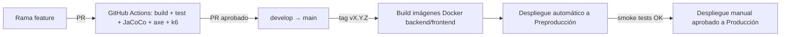

# Plan Técnico — 003 · Implantación (MF0493_3)

**Basado en:** `specs/000-funcional/spec.md`, `specs/001-entorno-cliente/plan.md`,
`specs/002-entorno-servidor/plan.md` · **Rige bajo:** `memory/constitution.md` v3.0.0
**Rama:** `feature/003-implantacion` (se abre desde `develop` **solo tras mergear**
`feature/002-entorno-servidor`)
**Unidad de competencia:** UC0493_3 — Implementar, verificar y documentar aplicaciones web en
entornos internet, intranet y extranet
**Fecha:** 2026-09-22

> Este módulo **no añade funcionalidad de negocio nueva**: integra lo que `001` y `002`
> construyeron por separado, lo verifica de extremo a extremo y lo despliega. Si aparece una
> discrepancia entre lo que el cliente espera y lo que el servidor entrega, se corrige contra el
> contrato de `spec.md` §12 — no se parchea localmente en uno de los dos lados.

---

## 1. Alcance de este módulo

**Sí hace:** integración real cliente↔servidor (desactivar MSW), pruebas E2E de las 9 HU contra
el sistema completo, pruebas de rendimiento, hardening de seguridad, documentación final,
contenedorización para los 3 entornos, CI/CD, runbook de despliegue.

**No hace:** nueva lógica de negocio (eso ya cerró en `001`/`002`); si durante la integración se
descubre que falta una regla de negocio, se abre como cambio de `spec.md`, no se improvisa aquí.

## 2. Paso 0 — Integración cliente-servidor

1. En `frontend/`, sustituir el arranque de MSW por una variable de entorno
   `VITE_API_BASE_URL=http://localhost:8080/api/v1` y desactivar `mocks/browser.js` en modo
   `production`/`integration`.
2. Ejecutar las 9 HU manualmente contra el sistema real antes de automatizar nada — es la primera
   señal de si el contrato realmente coincidió entre `001` y `002` (complementa la verificación ya
   hecha en `002-entorno-servidor/plan.md` §7).
3. Cualquier discrepancia encontrada aquí se registra como *bug* con referencia a qué lado
   (cliente o servidor) se desvió del contrato de §12, y se corrige en ese lado — nunca añadiendo
   un caso especial en el otro.

## 3. Stack adicional de este módulo

| Pieza | Tecnología | Justificación |
|---|---|---|
| E2E | Playwright | Cubre las 9 HU de extremo a extremo contra cliente + servidor reales. |
| Accesibilidad E2E | axe-core integrado en Playwright | Repite la verificación de `001` pero contra el sistema íntegro, no solo componentes aislados. |
| Rendimiento | k6 | Mide RNF-001 (p95 < 2s) sobre los endpoints de lectura más usados. |
| Análisis de dependencias | OWASP Dependency-Check | SCA de backend y frontend en CI. |
| Contenedores | Docker + Docker Compose (`docker-compose.prod.yml`) | Entorno reproducible en `pre`/`prod`. |
| CI/CD | GitHub Actions | Build, test, cobertura, build de imágenes, despliegue a `pre` automático y a `prod` manual aprobado. |
| Proxy inverso / TLS | Nginx o Traefik | Termina TLS, sirve el frontend, hace de reverse proxy a la API. |

**Reversibilidad (Principio 3 v3.0.0):** sustituible sin rediseño — Nginx↔Traefik, k6↔otra
herramienta de carga, GitHub Actions↔otro runner de CI (todas intercambiables detrás de la misma
interfaz: "hay un proxy con TLS", "hay pruebas de carga", "hay CI"). Estructural — Docker/Docker
Compose como unidad de despliegue (el `docker-compose.prod.yml` de §4 y el runbook de despliegue
lo asumen) y Playwright como *test runner* E2E (los `e2e/tests/*.spec.ts` de `tasks.md` dependen de
su API).

## 4. Estrategia de despliegue

| Entorno | Propósito | Infraestructura | Datos |
|---|---|---|---|
| **Desarrollo (dev)** | Trabajo diario | `docker-compose.yml` (backend + frontend + PostgreSQL) | Seed de ejemplo |
| **Preproducción (pre)** | Validación de PRs, E2E automatizados | Mismo compose en contenedor efímero de CI, o VPS de staging | Copia anonimizada o seed extendido |
| **Producción (prod)** | Uso real | `docker-compose.prod.yml` detrás de proxy inverso con TLS (ver **CA-08** de `spec.md` §13: infraestructura concreta pendiente de decisión) | Datos reales, con backups programados |

- **Idempotencia:** las migraciones Flyway son la única vía de cambio de esquema; `docker compose
  up` es repetible sin efectos secundarios.
- **Rollback:** cada imagen se etiqueta con el SHA del commit y el tag semver; el rollback
  redespliega la imagen anterior. Las migraciones se diseñan aditivas para minimizar este riesgo
  (Flyway community no soporta undo automático).

## 5. Plan de pruebas de este módulo

| Tipo | Herramienta | Alcance | Umbral |
|---|---|---|---|
| E2E | Playwright | HU-01 a HU-09 contra cliente + servidor reales | 100% de las HU con ≥1 test en verde |
| Accesibilidad E2E | axe-core en Playwright | Todas las páginas, sistema íntegro | 0 violaciones críticas/serias |
| Rendimiento | k6 | `GET /tareas`, `GET /modulos` | p95 < 2s con 50 VUs (ajustar según **CA-09**) |
| Seguridad | OWASP Dependency-Check | Dependencias backend + frontend | 0 vulnerabilidades altas/críticas sin mitigar |
| Cabeceras HTTP | `curl -I` manual + checklist | Todas las respuestas | CSP, `X-Content-Type-Options`, `X-Frame-Options`, HSTS presentes |

## 6. Riesgos identificados y mitigaciones

| ID | Riesgo | Mitigación |
|---|---|---|
| R-01 | El contrato de §12 no coincidió exactamente entre `001` y `002` pese a las verificaciones previas | Paso 0 de este plan ejecuta las 9 HU manualmente antes de automatizar nada |
| R-02 | Fuga de datos personales de alumnado (RGPD/LOPDGDD) | RBAC + auditoría + cifrado de infraestructura + anonimización ya construidos en `002` (TS.27–TS.33); entorno `pre` con datos anonimizados, nunca reales — pendiente de resolver la **base legal/retención de CA-05** antes de ir a `prod` con datos reales |
| R-03 | Consideraciones abiertas (CA-01 a CA-10 de `spec.md` §13) sin resolver antes del despliegue a `prod` | Este módulo no despliega a `prod` con CA-01 (almacenamiento de ficheros) o la parte legal de CA-05 (RGPD, base legal/retención) todavía abiertas — son bloqueantes, no opcionales. CA-04 (sesión) y CA-03 (fuerza bruta) ya están resueltas (ver ADR-0002); CA-10 (ENS) solo bloquea si el despliegue real es para una Administración Pública |
| R-04 | Deuda de fidelidad al certificado en el entorno cliente (ADR-0001) | Ya documentada y aceptada; este módulo no la revierte ni la oculta |

## 7. Salida de este módulo (Definition of Done)

- Cliente y servidor integrados y verificados manualmente (Paso 0) antes de automatizar.
- Suite E2E completa en verde en CI, incluyendo accesibilidad.
- `docker-compose.prod.yml` desplegado con éxito en un entorno de prueba, con TLS válido.
- Runbook de despliegue y rollback documentado y probado al menos una vez.
- **CA-01 resuelta y la parte legal de CA-05 de `spec.md` §13 resuelta** antes de cualquier
  despliegue con datos reales de alumnado — si no lo están, este módulo se cierra en `pre`, no en
  `prod`. (CA-04 y CA-03 ya resueltas por ADR-0002; el mecanismo técnico de CA-05 — cifrado +
  anonimización — también resuelto, ver `002-entorno-servidor/tasks.md` TS.27–TS.33.)
